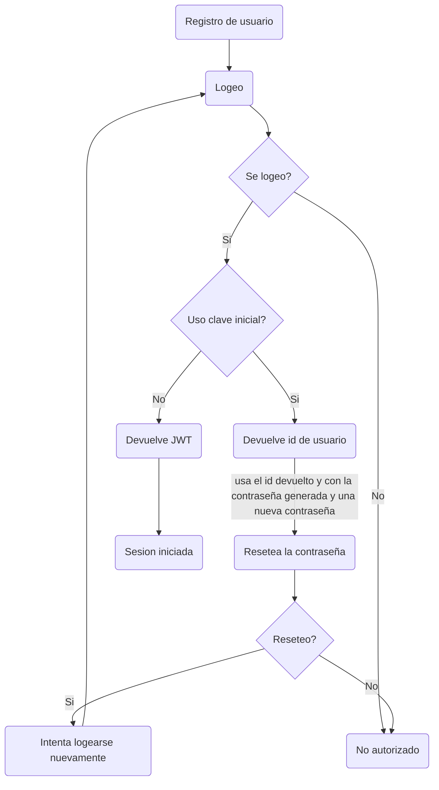

```mermaid
flowchart TD
	A(Registro de usuario)
	B(Logeo)
	C{Se logeo?}
	D(Devuelve id de usuario)
	E(No autorizado)

	F(Resetea la contraseña)
	G{Reseteo?}
	H(Intenta logearse nuevamente)

	I{Uso clave inicial?}

	J(Devuelve JWT)
	K(Sesion iniciada)

	A --> B
	B --> C
	C --> |Si| I

	I --> |Si| D
	I --> |No| J
	J --> K

	C --> |No| E

	D --> |usa el id devuelto y con la contraseña generada y una nueva contraseña| F

	F --> G
	G --> |Si| H --> B
	G --> |No| E


```
