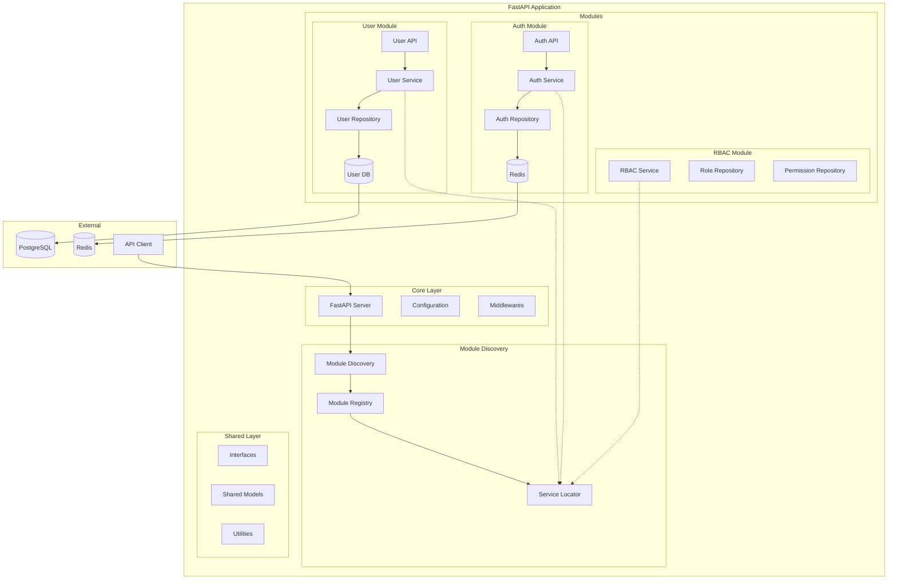
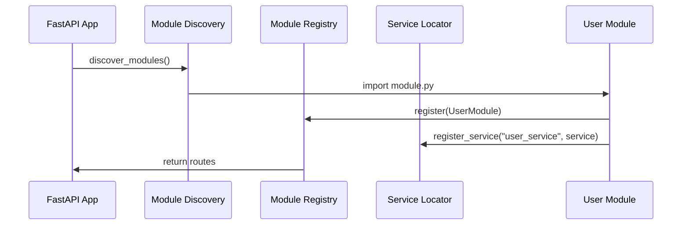
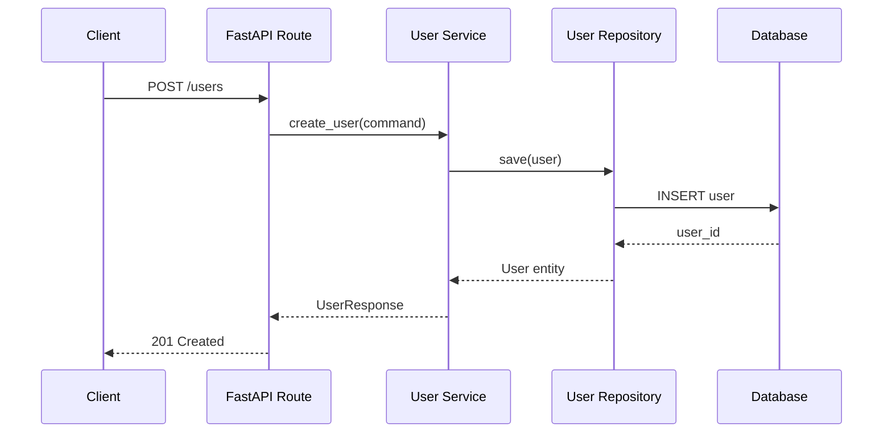

# Arquitectura del Proyecto

## Visión General

El proyecto implementa una **arquitectura hexagonal modular** que combina los principios de:

- **Hexagonal Architecture (Ports & Adapters)**
- **Modular Monolith**
- **Dependency Injection**
- **Service Locator Pattern**

## Diagrama de Arquitectura



## Capas de la Arquitectura

### 1. Core Layer
**Responsabilidad**: Configuración central y servidor FastAPI

```
core/
├── config/          # Configuración de la aplicación
├── db/             # Configuración de base de datos
├── exceptions/     # Excepciones personalizadas
└── fastapi/        # Configuración de FastAPI
    ├── dependencies/
    ├── middlewares/
    └── server/
```

### 2. Module Layer
**Responsabilidad**: Lógica de negocio modular

Cada módulo sigue la estructura hexagonal:

```
modules/[module_name]/
├── adapter/
│   ├── input/      # Controladores (API, CLI, etc.)
│   └── output/     # Repositorios, APIs externas
├── application/    # Casos de uso y servicios
├── domain/         # Entidades y lógica de dominio
├── container.py    # Inyección de dependencias
└── module.py       # Definición del módulo
```

### 3. Shared Layer
**Responsabilidad**: Interfaces y utilidades compartidas

```
shared/
├── interfaces/     # Contratos entre módulos
├── models.py       # Modelos compartidos
└── dependencies.py # Dependencias globales
```

## Principios Arquitectónicos

### 1. Separación de Responsabilidades

- **Domain**: Lógica de negocio pura
- **Application**: Casos de uso y orquestación
- **Infrastructure**: Detalles técnicos (DB, API, etc.)

### 2. Inversión de Dependencias

```python
# ✅ Correcto - Depende de abstracción
class UserService:
    def __init__(self, repository: UserRepositoryInterface):
        self.repository = repository

# ❌ Incorrecto - Depende de implementación concreta
class UserService:
    def __init__(self):
        self.repository = SQLUserRepository()
```

### 3. Modularidad

Cada módulo es:
- **Independiente**: Puede funcionar por sí solo
- **Portable**: Se puede extraer fácilmente
- **Testeable**: Dependencias mockeables

### 4. Comunicación entre Módulos

```python
# Comunicación a través del Service Locator
role_service = service_locator.get_service("rbac.role_service")
user_roles = role_service.get_user_roles(user_id)
```

## Flujo de Datos

### 1. Inicialización


### 2. Request Processing


## Patrones Utilizados

### 1. Repository Pattern
Abstrae el acceso a datos

### 2. Service Layer Pattern
Encapsula la lógica de negocio

### 3. Dependency Injection
Gestiona dependencias automáticamente

### 4. Service Locator
Permite comunicación entre módulos

### 5. Module Pattern
Organiza funcionalidades en módulos cohesivos

## Ventajas de esta Arquitectura

- ✅ **Testabilidad**: Fácil mockear dependencias
- ✅ **Mantenibilidad**: Código organizado y separado
- ✅ **Escalabilidad**: Fácil agregar nuevos módulos
- ✅ **Flexibilidad**: Cambiar implementaciones sin afectar otros módulos
- ✅ **Reutilización**: Módulos portables entre proyectos