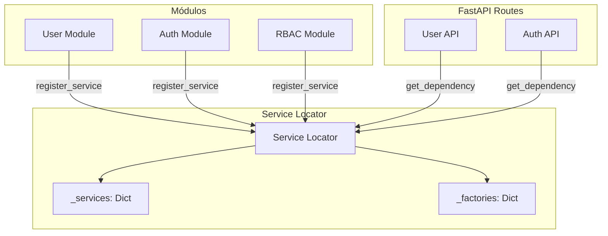

# Service Locator

## Introducción

El **Service Locator** es el mecanismo central para la comunicación entre módulos, permitiendo que los módulos accedan a servicios de otros módulos sin crear dependencias directas.

## Arquitectura del Service Locator



## Funcionamiento

### 1. Registro de Servicios

Durante el auto-discovery, cada módulo registra sus servicios:

```python
# En module_discovery.py
def registre_module(subclass_attribute: type[ModuleInterface]):
    subclass_module = subclass_attribute()
    ModuleRegistry().register(subclass_module)
    
    # Registro automático en service_locator
    for name, service in subclass_module.service.items():
        service_locator.register_service(name, service)
```

### 2. Detección Automática de Factory Providers

El service_locator detecta automáticamente si un servicio es un Factory provider:

```python
def register_service(self, name: str, service: Any) -> None:
    # Detecta Factory providers automáticamente
    if isinstance(service, Factory):
        # Se maneja como factory
        self._services[name] = service
    else:
        # Servicio normal
        self._services[name] = service
```

## Métodos Principales

### get_service() - Para uso normal

Devuelve la **instancia del servicio** para uso directo entre servicios.

```python
def get_service(self, name: str) -> Any:
    """Obtiene un servicio resuelto para uso normal"""
    if name in self._services:
        service = self._services[name]
        if isinstance(service, Factory):
            return service()  # Resuelve el Factory
        return service
    
    if name in self._factories:
        service = self._factories[name]()
        self._services[name] = service  # Cache
        return service
    
    return None
```

**Uso:**
```python
# Dentro de un servicio
role_service = service_locator.get_service("rbac.role_service")
user_roles = await role_service.get_user_roles(user_id)
```

### get_dependency() - Para FastAPI

Devuelve una **función wrapper** que FastAPI puede inspeccionar.

```python
def get_dependency(self, name: str) -> Callable:
    """Obtiene una función para usar con FastAPI Depends"""
    if name in self._services:
        service = self._services[name]
        if isinstance(service, Factory):
            def factory_wrapper():
                return service()
            factory_wrapper.__name__ = f"get_{name}_factory"
            return factory_wrapper
        else:
            def service_wrapper():
                return service
            service_wrapper.__name__ = f"get_{name}_service"
            return service_wrapper
    
    if name in self._factories:
        return self._factories[name]
    
    def not_found_wrapper():
        return None
    not_found_wrapper.__name__ = f"get_{name}_not_found"
    return not_found_wrapper
```

**Uso:**
```python
# En rutas FastAPI
@router.get("/search")
async def search_users(
    role_service = Depends(service_locator.get_dependency("rbac.role_service")),
    app_service = Depends(service_locator.get_dependency("app_module_service")),
):
    # Usar los servicios
    pass
```

## Registro de Servicios

### Desde Módulos

Los módulos registran sus servicios automáticamente:

```python
# modules/user/module.py
class UserModule(ModuleInterface):
    @property
    def service(self) -> Dict[str, object]:
        return {
            "user_service": self._container.service,  # Factory provider
        }
```

### Manual

También puedes registrar servicios manualmente:

```python
# Registrar servicio directo
service_locator.register_service("my_service", MyService())

# Registrar factory
service_locator.register_factory("lazy_service", lambda: ExpensiveService())
```

## Patrones de Uso

### 1. Comunicación Entre Módulos

```python
# En UserService, usar RBACService
class UserService:
    def __init__(self, repository: UserRepositoryInterface):
        self.repository = repository
    
    async def assign_role_to_user(self, user_id: str, role_id: int):
        # Obtener servicio externo
        rbac_service = service_locator.get_service("rbac.role_service")
        
        # Validar que el rol existe
        role = await rbac_service.get_role_by_id(role_id)
        if not role:
            raise ValueError("Role not found")
        
        # Asignar rol al usuario
        return await self.repository.assign_role(user_id, role_id)
```

### 2. Inyección en FastAPI

```python
# Para servicios externos
@router.get("/users/{user_id}/permissions")
async def get_user_permissions(
    user_id: str,
    user_service: UserService = Depends(Provide[UserContainer.service]),  # Interno
    rbac_service = Depends(service_locator.get_dependency("rbac.role_service")),  # Externo
):
    user = await user_service.get_user_by_id(user_id)
    permissions = await rbac_service.get_user_permissions(user_id)
    return {"user": user, "permissions": permissions}
```

### 3. Servicios Condicionales

```python
# Registrar diferentes implementaciones según configuración
if env.USE_REDIS_CACHE:
    service_locator.register_service("cache_service", RedisCacheService())
else:
    service_locator.register_service("cache_service", MemoryCacheService())
```

## Servicios Disponibles

### Servicios del Sistema

| Nombre | Módulo | Descripción |
|--------|--------|-------------|
| `user_service` | user | Gestión de usuarios |
| `auth_service` | auth | Autenticación |
| `auth.jwt_service` | auth | Gestión de JWT |
| `rbac.role_service` | rbac | Gestión de roles |
| `rbac.permission_service` | rbac | Gestión de permisos |
| `app_module_service` | module | Gestión de módulos |
| `file_storage_service` | file_storage | Almacenamiento de archivos |

### Verificar Servicios Disponibles

```python
# Listar todos los servicios registrados
available_services = []
for name in service_locator._services.keys():
    available_services.append(name)
for name in service_locator._factories.keys():
    available_services.append(name)

print("Servicios disponibles:", available_services)
```

## Testing con Service Locator

### Mock de Servicios

```python
import pytest
from unittest.mock import AsyncMock

@pytest.fixture
def mock_rbac_service():
    mock_service = AsyncMock()
    mock_service.get_user_roles.return_value = ["admin", "user"]
    
    # Override en service_locator
    service_locator.register_service("rbac.role_service", mock_service)
    
    yield mock_service
    
    # Cleanup
    service_locator.clear()
```

### Test de Integración

```python
async def test_user_role_assignment():
    # Usar servicios reales registrados
    user_service = service_locator.get_service("user_service")
    rbac_service = service_locator.get_service("rbac.role_service")
    
    # Test de integración real
    result = await user_service.assign_role_to_user("user123", 1)
    assert result is not None
```

## Debugging

### Verificar Registro

```python
# Verificar si un servicio está registrado
if service_locator.has_service("rbac.role_service"):
    print("Servicio RBAC disponible")
else:
    print("Servicio RBAC no encontrado")
```

### Inspeccionar Servicios

```python
# Ver todos los servicios registrados
print("Servicios:", list(service_locator._services.keys()))
print("Factories:", list(service_locator._factories.keys()))
```

### Logs de Resolución

```python
import logging

# Habilitar logs detallados
logging.basicConfig(level=logging.DEBUG)

# El service_locator loggeará las resoluciones
service = service_locator.get_service("user_service")
```

## Buenas Prácticas

### ✅ Hacer

- Usar `get_service()` para comunicación entre servicios
- Usar `get_dependency()` para inyección en FastAPI
- Registrar servicios con nombres descriptivos
- Documentar las dependencias entre módulos

### ❌ Evitar

- Acceso directo a `_services` o `_factories`
- Dependencias circulares entre servicios
- Registro de servicios con estado mutable como singleton
- Uso excesivo del service_locator (preferir dependency injection cuando sea posible)

## Ventajas del Service Locator

- ✅ **Desacoplamiento**: Los módulos no dependen directamente entre sí
- ✅ **Flexibilidad**: Fácil intercambiar implementaciones
- ✅ **Testabilidad**: Fácil mockear servicios externos
- ✅ **Modularidad**: Los módulos pueden funcionar independientemente
- ✅ **Auto-discovery**: Registro automático de servicios