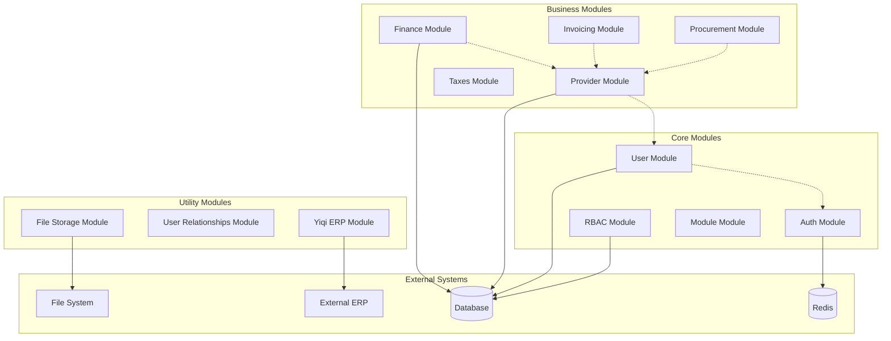

# Documentación de Módulos

## Índice de Módulos

### Módulos Core del Sistema

1. **[Auth](./auth.md)** - Autenticación y gestión de sesiones
2. **[User](./user.md)** - Gestión de usuarios
3. **[RBAC](./rbac.md)** - Roles, permisos y control de acceso
4. **[Module](./module.md)** - Gestión de módulos del sistema

### Módulos de Negocio

5. **[Provider](./provider.md)** - Gestión de proveedores
6. **[Finance](./finance.md)** - Gestión financiera
7. **[Invoicing](./invoicing.md)** - Facturación
8. **[Procurement](./procurement.md)** - Compras y adquisiciones
9. **[Taxes](./taxes.md)** - Gestión de impuestos

### Módulos de Utilidades

10. **[File Storage](./file_storage.md)** - Almacenamiento de archivos
11. **[User Relationships](./user_relationships.md)** - Relaciones entre usuarios
12. **[Yiqi ERP](./yiqi_erp.md)** - Integración con sistema ERP externo

## Arquitectura Modular



## Dependencias Entre Módulos

### Dependencias Directas

| Módulo | Depende de | Propósito |
|--------|------------|-----------|
| User | Auth | Autenticación de usuarios |
| Provider | User, RBAC | Validación de permisos |
| Finance | Provider | Datos de proveedores |
| Invoicing | Provider | Facturación a proveedores |
| Procurement | Provider, User | Compras y aprobaciones |

### Servicios Compartidos

Todos los módulos pueden acceder a estos servicios a través del **Service Locator**:

- `auth_service` - Autenticación
- `auth.jwt_service` - Gestión de tokens JWT
- `user_service` - Gestión de usuarios
- `rbac.role_service` - Gestión de roles
- `rbac.permission_service` - Gestión de permisos
- `app_module_service` - Gestión de módulos

## Convenciones de Módulos

### Estructura Estándar

Cada módulo sigue esta estructura:

```
modules/[module_name]/
├── adapter/
│   ├── input/          # Controladores (API, CLI)
│   └── output/         # Repositorios, APIs externas
├── application/        # Servicios de aplicación
│   ├── dto/           # DTOs y comandos
│   ├── service/       # Servicios de aplicación
│   └── exception/     # Excepciones específicas
├── domain/            # Lógica de dominio
│   ├── entity/        # Entidades de dominio
│   ├── repository/    # Interfaces de repositorio
│   ├── usecase/       # Casos de uso
│   └── command/       # Comandos de dominio
├── container.py       # Inyección de dependencias
└── module.py         # Definición del módulo
```

### Naming Conventions

- **Servicios**: `[module]_service` (ej: `user_service`)
- **Servicios específicos**: `[module].[service]_service` (ej: `auth.jwt_service`)
- **Rutas**: `/[module]` (ej: `/users`, `/providers`)
- **Tags**: `[Module]` (ej: `Users`, `Providers`)

## Estado de los Módulos

### ✅ Completamente Implementados

- **Auth** - Autenticación completa con JWT
- **User** - CRUD de usuarios
- **RBAC** - Sistema de roles y permisos
- **Provider** - Gestión de proveedores
- **File Storage** - Almacenamiento de archivos

### 🚧 En Desarrollo

- **Invoicing** - Estructura de dominio definida
- **Procurement** - Entidades planificadas
- **Taxes** - Configuración de permisos

### ✅ Funcionales

- **Finance** - Gestión de monedas
- **Module** - Gestión de módulos del sistema
- **User Relationships** - Relaciones dinámicas usuario-entidad
- **Yiqi ERP** - Integración con ERP externo

## Cómo Leer la Documentación

Cada módulo incluye:

1. **Descripción** - Qué hace el módulo
2. **Funcionalidades** - Características principales
3. **Arquitectura** - Estructura interna
4. **API Endpoints** - Rutas disponibles
5. **Servicios** - Servicios que expone
6. **Dependencias** - Qué otros módulos necesita
7. **Ejemplos de Uso** - Código real del proyecto
8. **Testing** - Cómo probar el módulo

## Próximos Pasos

1. Lee la documentación del módulo que te interese
2. Revisa los ejemplos de código
3. Consulta las [Buenas Prácticas](../11-best-practices.md)
4. Sigue el [Tutorial](../12-tutorial.md) para crear tu propio módulo