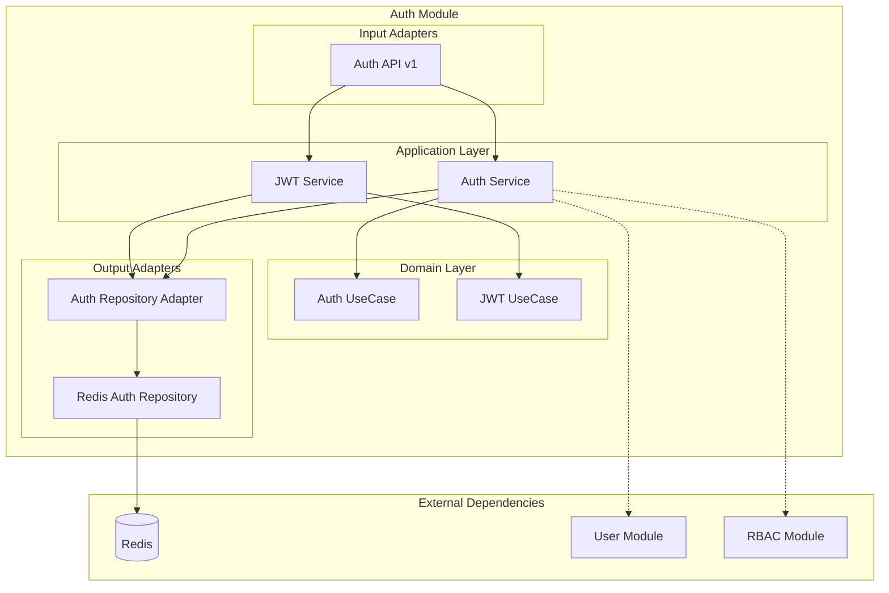

# Módulo Auth

## Descripción

El módulo **Auth** es responsable de la autenticación y autorización de usuarios en el sistema. Maneja el login, registro, gestión de tokens JWT y sesiones de usuario utilizando Redis como almacenamiento de sesiones.

## Funcionalidades

- ✅ **Login de usuarios** con credenciales
- ✅ **Registro de nuevos usuarios**
- ✅ **Gestión de tokens JWT** (access y refresh tokens)
- ✅ **Verificación de tokens**
- ✅ **Renovación de tokens** (refresh)
- ✅ **Reset de contraseñas**
- ✅ **Gestión de sesiones** en Redis
- ✅ **Integración con RBAC** para permisos

## Arquitectura del Módulo



## Servicios Expuestos

El módulo registra estos servicios en el Service Locator:

```python
@property
def service(self) -> Dict[str, object]:
    return {
        "auth_service": self._container.service,        # Servicio principal de autenticación
        "auth.jwt_service": self._container.jwt_service, # Servicio específico de JWT
    }
```

### auth_service
- **Propósito**: Autenticación principal de usuarios
- **Funciones**: Login, registro, reset de contraseñas
- **Dependencias**: User module, RBAC module

### auth.jwt_service
- **Propósito**: Gestión de tokens JWT
- **Funciones**: Crear, verificar y renovar tokens
- **Dependencias**: RBAC module para permisos

## API Endpoints

### Base Path: `/auth/v1/auth`

| Método | Endpoint | Descripción | Autenticación |
|--------|----------|-------------|---------------|
| POST | `/login` | Iniciar sesión | No |
| POST | `/register` | Registrar usuario | No |
| POST | `/refresh` | Renovar token | No |
| POST | `/verify` | Verificar token | No |
| POST | `/password_reset` | Cambiar contraseña | Sí |

### Ejemplos de Uso

#### Login
```python
# Endpoint: POST /auth/v1/auth/login
@auth_router.post("/login")
@inject
async def login(
    request: AuthLoginRequest = Form(),
    usecase: AuthUseCase = Depends(Provide[AuthContainer.service]),
):
    data = await usecase.login(request.nickname, request.password)
    return data
```

**Request:**
```json
{
    "nickname": "usuario@ejemplo.com",
    "password": "mi_contraseña"
}
```

**Response:**
```json
{
    "access_token": "eyJ0eXAiOiJKV1QiLCJhbGciOiJIUzI1NiJ9...",
    "refresh_token": "eyJ0eXAiOiJKV1QiLCJhbGciOiJIUzI1NiJ9...",
    "token_type": "bearer",
    "expires_in": 3600
}
```

#### Refresh Token
```python
# Endpoint: POST /auth/v1/auth/refresh
@auth_router.post("/refresh", response_model=RefreshTokenResponse)
@inject
async def refresh_token(
    request: RefreshTokenRequest,
    usecase: JwtUseCase = Depends(Provide[AuthContainer.jwt_service]),
):
    token = await usecase.create_refresh_token(refresh_token=request.refresh_token)
    return token
```

#### Verificar Token
```python
# Endpoint: POST /auth/v1/auth/verify
@auth_router.post("/verify")
@inject
async def verify_token(
    request: VerifyTokenRequest,
    usecase: JwtUseCase = Depends(Provide[AuthContainer.jwt_service]),
):
    decoded_token = await usecase.verify_token(token=request.token)
    return decoded_token
```

## Container de Dependencias

```python
class AuthContainer(DeclarativeContainer):
    # Configuración de Redis
    redis_session_repository = Object(RedisClient.session)
    redis_permission_repository = Object(RedisClient.permission)
    
    # Repositorio Redis como Singleton
    redis_repository = Singleton(
        RedisAuthRepository,
        session_repository=redis_session_repository,
        permission_repository=redis_permission_repository,
    )
    
    # Adaptador del repositorio
    repository_adapter = Factory(AuthRepositoryAdapter, repository=redis_repository)
    
    # Servicio principal de autenticación
    service = Factory(
        AuthService,
        auth_repository=repository_adapter,
        user_repository=UserContainer.repository_adapter,  # Dependencia externa
        rbac_repository=RBACContainer.repository_adapter,  # Dependencia externa
    )
    
    # Servicio de JWT
    jwt_service = Factory(
        JwtService,
        auth_repository=repository_adapter,
        rbac_repository=RBACContainer.repository_adapter,
    )
```

## Dependencias Externas

### Módulos Requeridos
- **User Module**: Para validar credenciales y obtener datos de usuario
- **RBAC Module**: Para obtener roles y permisos del usuario

### Infraestructura
- **Redis**: Almacenamiento de sesiones y tokens
- **PostgreSQL**: A través del User module para datos de usuario

## Uso en Otros Módulos

### Obtener Servicio de Autenticación

```python
# En otro módulo
from shared.interfaces.service_locator import service_locator

# Obtener el servicio de autenticación
auth_service = service_locator.get_service("auth_service")
current_user = await auth_service.get_current_user(token)

# Obtener el servicio JWT
jwt_service = service_locator.get_service("auth.jwt_service")
is_valid = await jwt_service.verify_token(token)
```

### Inyección en FastAPI

```python
# Para servicios externos al módulo auth
@router.get("/protected-endpoint")
async def protected_endpoint(
    auth_service = Depends(service_locator.get_dependency("auth_service")),
):
    current_user = await auth_service.get_current_user()
    return {"user": current_user}
```

## Configuración

### Variables de Entorno

```env
# JWT Configuration
JWT_SECRET_KEY=your-secret-key-here
JWT_ALGORITHM=HS256
JWT_ACCESS_TOKEN_EXPIRE_MINUTES=30
JWT_REFRESH_TOKEN_EXPIRE_DAYS=7

# Redis Configuration
REDIS_URL=redis://localhost:6379
REDIS_SESSION_DB=0
REDIS_PERMISSION_DB=1
```

### Redis Databases

El módulo utiliza dos bases de datos Redis separadas:
- **DB 0**: Sesiones de usuario
- **DB 1**: Cache de permisos

## Testing

### Test de Login

```python
@pytest.mark.asyncio
async def test_login_success():
    # Mock de dependencias
    mock_auth_service = AsyncMock()
    mock_auth_service.login.return_value = {
        "access_token": "test_token",
        "token_type": "bearer"
    }
    
    # Test del endpoint
    response = await client.post("/auth/v1/auth/login", data={
        "nickname": "test@example.com",
        "password": "password123"
    })
    
    assert response.status_code == 200
    assert "access_token" in response.json()
```

### Test de Verificación de Token

```python
@pytest.mark.asyncio
async def test_verify_token():
    # Mock del servicio JWT
    mock_jwt_service = AsyncMock()
    mock_jwt_service.verify_token.return_value = {
        "user_id": "123",
        "exp": 1234567890
    }
    
    response = await client.post("/auth/v1/auth/verify", json={
        "token": "valid_jwt_token"
    })
    
    assert response.status_code == 200
```

## Seguridad

### Mejores Prácticas Implementadas

- ✅ **Tokens JWT** con expiración
- ✅ **Refresh tokens** para renovación segura
- ✅ **Hash de contraseñas** (a través del User module)
- ✅ **Sesiones en Redis** para invalidación rápida
- ✅ **Separación de permisos** por base de datos Redis

### Consideraciones de Seguridad

- Los tokens se almacenan en Redis para permitir invalidación
- Las contraseñas nunca se almacenan en texto plano
- Los refresh tokens tienen mayor duración pero pueden ser revocados
- Las sesiones se pueden invalidar globalmente

## Troubleshooting

### Problemas Comunes

1. **Token expirado**
   - Usar el refresh token para obtener uno nuevo
   - Verificar configuración de `JWT_ACCESS_TOKEN_EXPIRE_MINUTES`

2. **Redis no disponible**
   - Verificar conexión a Redis
   - Revisar configuración de `REDIS_URL`

3. **Usuario no encontrado**
   - Verificar que el User module esté funcionando
   - Revisar logs del servicio de autenticación

### Logs Útiles

```python
# Habilitar logs de autenticación
import logging
logging.getLogger('modules.auth').setLevel(logging.DEBUG)
```

## Roadmap

### Funcionalidades Futuras

- [ ] **OAuth2** integration (Google, GitHub)
- [ ] **Two-Factor Authentication** (2FA)
- [ ] **Session management** UI
- [ ] **Audit logs** para accesos
- [ ] **Rate limiting** para login attempts
- [ ] **Password policies** configurables