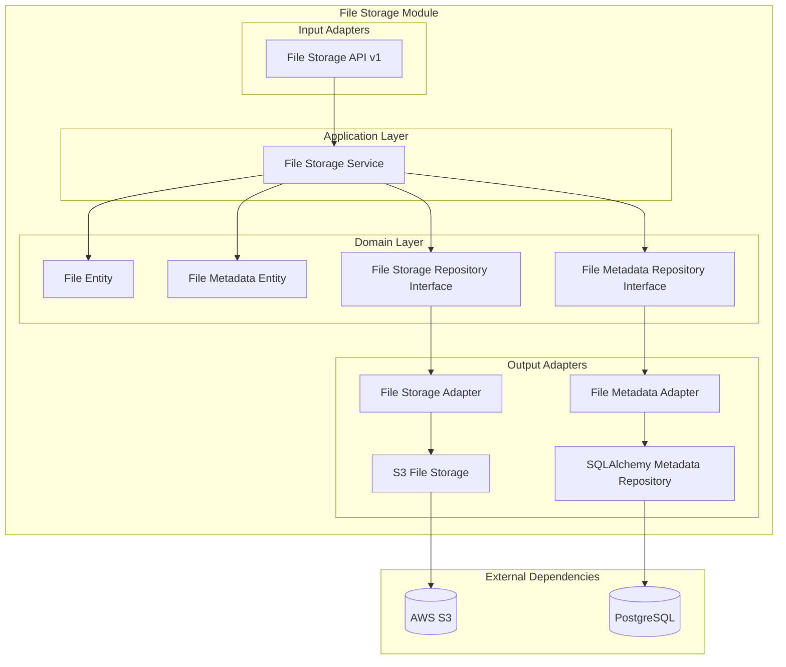

# Módulo File Storage

## Descripción

El módulo **File Storage** proporciona un sistema completo de almacenamiento y gestión de archivos. Maneja la subida, descarga, organización y metadatos de archivos, con soporte para múltiples proveedores de almacenamiento (S3, local, etc.) y gestión de metadatos en base de datos.

## Funcionalidades

- ✅ **Subida de archivos** con validación
- ✅ **Descarga de archivos** con control de acceso
- ✅ **Almacenamiento en S3** (AWS)
- ✅ **Gestión de metadatos** en PostgreSQL
- ✅ **Organización por carpetas** virtuales
- ✅ **Validación de tipos** de archivo
- ✅ **Control de tamaño** máximo
- ✅ **URLs temporales** para acceso seguro
- ✅ **Eliminación segura** de archivos

## Arquitectura del Módulo



## Servicios Expuestos

```python
@property
def service(self) -> Dict[str, object]:
    return {"file_storage_service": self._container.service}
```

### file_storage_service
- **Propósito**: Gestión completa de archivos
- **Funciones**: Upload, download, delete, metadata management
- **Dependencias**: AWS S3, PostgreSQL

## API Endpoints

### Base Path: `/filestorage/v1/filestorage`

| Método | Endpoint | Descripción | Autenticación |
|--------|----------|-------------|---------------|
| POST | `/upload` | Subir archivo | Sí |
| GET | `/download/{file_id}` | Descargar archivo | Sí |
| GET | `/metadata/{file_id}` | Obtener metadatos | Sí |
| DELETE | `/{file_id}` | Eliminar archivo | Sí |
| GET | `/list` | Listar archivos | Sí |
| POST | `/folder` | Crear carpeta virtual | Sí |

## Container de Dependencias

```python
class FileStorageContainer(DeclarativeContainer):
    config = Configuration(pydantic_settings=[env])
    
    # Almacenamiento S3 como Singleton
    s3_storage_repo = Singleton(
        S3FileStorage,
        bucket_name=config.AWS_ACCESS_BUCKET_NAME,
        region=config.AWS_ACCESS_REGION,
        access_key=config.AWS_ACCESS_KEY,
        secret_key=config.AWS_ACCESS_SECRET_KEY,
    )
    
    # Repositorio de metadatos como Singleton
    metadata_repo = Singleton(FileMetadataSQLAlchemyRepository)
    
    # Adaptadores como Factory
    file_storage_adapter = Factory(
        FileStorageAdapter, 
        file_storage_repository=s3_storage_repo
    )
    
    file_metadata_adapter = Factory(
        FileMetadataAdapter, 
        file_metadata_repository=metadata_repo
    )
    
    # Servicio principal
    service = Factory(
        FileStorageService,
        file_storage_repository=file_storage_adapter,
        file_metadata_repository=file_metadata_adapter,
    )
```

### Características del Container

- **Configuración externa**: Usa variables de entorno para AWS
- **Dual storage**: Archivos en S3, metadatos en PostgreSQL
- **Patrón adaptador**: Abstracción del proveedor de almacenamiento

## Ejemplos de Uso

### Subir Archivo

```python
# Endpoint: POST /filestorage/v1/filestorage/upload
@file_storage_router.post("/upload")
async def upload_file(
    file: UploadFile = File(...),
    folder: str = Form(""),
    service: FileStorageService = Depends(Provide[FileStorageContainer.service]),
):
    # Validar archivo
    if file.size > MAX_FILE_SIZE:
        raise HTTPException(400, "File too large")
    
    # Subir archivo
    result = await service.upload_file(
        file_data=await file.read(),
        filename=file.filename,
        content_type=file.content_type,
        folder=folder
    )
    
    return {
        "file_id": result.file_id,
        "url": result.url,
        "size": result.size
    }
```

**Request:**
```bash
curl -X POST "http://localhost:8000/filestorage/v1/filestorage/upload" \
  -H "Authorization: Bearer <token>" \
  -F "file=@documento.pdf" \
  -F "folder=invoices/2024"
```

**Response:**
```json
{
    "file_id": "uuid-123-456",
    "url": "https://bucket.s3.amazonaws.com/invoices/2024/documento.pdf",
    "size": 1024000,
    "content_type": "application/pdf",
    "uploaded_at": "2024-01-15T10:30:00Z"
}
```

### Descargar Archivo

```python
# Endpoint: GET /filestorage/v1/filestorage/download/{file_id}
@file_storage_router.get("/download/{file_id}")
async def download_file(
    file_id: str,
    service: FileStorageService = Depends(Provide[FileStorageContainer.service]),
):
    # Obtener metadatos
    metadata = await service.get_file_metadata(file_id)
    if not metadata:
        raise HTTPException(404, "File not found")
    
    # Generar URL temporal
    download_url = await service.generate_download_url(file_id, expires_in=3600)
    
    return RedirectResponse(url=download_url)
```

### Listar Archivos

```python
# Endpoint: GET /filestorage/v1/filestorage/list
@file_storage_router.get("/list")
async def list_files(
    folder: str = Query(""),
    limit: int = Query(20, le=100),
    offset: int = Query(0),
    service: FileStorageService = Depends(Provide[FileStorageContainer.service]),
):
    files = await service.list_files(
        folder=folder,
        limit=limit,
        offset=offset
    )
    
    return {
        "files": files,
        "total": len(files),
        "folder": folder
    }
```

## Uso en Otros Módulos

### Almacenar Archivos de Facturas

```python
# En el módulo Provider
from shared.interfaces.service_locator import service_locator

class DraftPurchaseInvoiceService:
    async def attach_file_to_invoice(self, invoice_id: int, file_data: bytes, filename: str):
        # Obtener servicio de almacenamiento
        file_storage_service = service_locator.get_service("file_storage_service")
        
        # Subir archivo a carpeta específica
        result = await file_storage_service.upload_file(
            file_data=file_data,
            filename=filename,
            folder=f"invoices/{invoice_id}",
            metadata={
                "invoice_id": invoice_id,
                "type": "invoice_attachment"
            }
        )
        
        # Guardar referencia en la factura
        invoice = await self.repository.get_by_id(invoice_id)
        invoice.attachments.append(result.file_id)
        await self.repository.save(invoice)
        
        return result
```

### Inyección en FastAPI

```python
# Para servicios externos al módulo file_storage
@router.post("/upload-document")
async def upload_document(
    file: UploadFile = File(...),
    file_storage_service = Depends(service_locator.get_dependency("file_storage_service")),
):
    result = await file_storage_service.upload_file(
        file_data=await file.read(),
        filename=file.filename,
        folder="documents"
    )
    return {"file_id": result.file_id}
```

## Modelos de Datos

### File Entity
```python
@dataclass
class File:
    id: Optional[str] = None
    filename: str = ""
    original_filename: str = ""
    content_type: str = ""
    size: int = 0
    folder: str = ""
    storage_path: str = ""
    checksum: str = ""
    uploaded_by: Optional[str] = None
    uploaded_at: Optional[datetime] = None
```

### File Metadata Entity
```python
@dataclass
class FileMetadata:
    file_id: str = ""
    filename: str = ""
    original_filename: str = ""
    content_type: str = ""
    size: int = 0
    folder: str = ""
    tags: List[str] = field(default_factory=list)
    metadata: dict = field(default_factory=dict)
    uploaded_by: Optional[str] = None
    uploaded_at: Optional[datetime] = None
    last_accessed: Optional[datetime] = None
    access_count: int = 0
```

## Configuración

### Variables de Entorno

```env
# AWS S3 Configuration
AWS_ACCESS_KEY=your-access-key
AWS_ACCESS_SECRET_KEY=your-secret-key
AWS_ACCESS_BUCKET_NAME=your-bucket-name
AWS_ACCESS_REGION=us-east-1

# File Storage Settings
FILE_STORAGE_MAX_SIZE=10MB
FILE_STORAGE_ALLOWED_TYPES=pdf,jpg,jpeg,png,doc,docx,xls,xlsx
FILE_STORAGE_DEFAULT_FOLDER=uploads
FILE_STORAGE_URL_EXPIRES=3600

# Security
FILE_STORAGE_VIRUS_SCAN=false
FILE_STORAGE_ENCRYPT_FILES=false
```

## Validaciones y Seguridad

### Validaciones Implementadas

```python
# Validaciones de archivos
- Tamaño máximo configurable
- Tipos de archivo permitidos
- Nombres de archivo seguros
- Validación de contenido vs extensión
- Límites de carpetas por usuario
```

### Seguridad

- ✅ **URLs temporales** para descarga segura
- ✅ **Validación de tipos** de archivo
- ✅ **Sanitización de nombres** de archivo
- ✅ **Control de acceso** por usuario
- ✅ **Checksums** para integridad
- ✅ **Logs de acceso** para auditoría

### Permisos Requeridos

- **Subir archivos**: `files.upload`
- **Descargar archivos**: `files.download`
- **Eliminar archivos**: `files.delete`
- **Gestionar carpetas**: `files.manage_folders`

## Proveedores de Almacenamiento

### AWS S3 (Implementado)

```python
class S3FileStorage:
    def __init__(self, bucket_name: str, region: str, access_key: str, secret_key: str):
        self.s3_client = boto3.client(
            's3',
            region_name=region,
            aws_access_key_id=access_key,
            aws_secret_access_key=secret_key
        )
        self.bucket_name = bucket_name
    
    async def upload_file(self, file_data: bytes, key: str) -> str:
        self.s3_client.put_object(
            Bucket=self.bucket_name,
            Key=key,
            Body=file_data
        )
        return f"s3://{self.bucket_name}/{key}"
    
    async def download_file(self, key: str) -> bytes:
        response = self.s3_client.get_object(Bucket=self.bucket_name, Key=key)
        return response['Body'].read()
    
    async def generate_presigned_url(self, key: str, expires_in: int = 3600) -> str:
        return self.s3_client.generate_presigned_url(
            'get_object',
            Params={'Bucket': self.bucket_name, 'Key': key},
            ExpiresIn=expires_in
        )
```

### Almacenamiento Local (Futuro)

```python
# Implementación futura para almacenamiento local
class LocalFileStorage:
    def __init__(self, base_path: str):
        self.base_path = Path(base_path)
    
    async def upload_file(self, file_data: bytes, key: str) -> str:
        file_path = self.base_path / key
        file_path.parent.mkdir(parents=True, exist_ok=True)
        
        with open(file_path, 'wb') as f:
            f.write(file_data)
        
        return str(file_path)
```

## Testing

### Test de Subida de Archivo

```python
@pytest.mark.asyncio
async def test_upload_file():
    # Mock de S3 storage
    mock_s3_storage = AsyncMock()
    mock_s3_storage.upload_file.return_value = "s3://bucket/test.pdf"
    
    # Mock de metadata repository
    mock_metadata_repo = AsyncMock()
    mock_metadata_repo.save.return_value = FileMetadata(
        file_id="uuid-123",
        filename="test.pdf",
        size=1024
    )
    
    # Test del servicio
    service = FileStorageService(mock_s3_storage, mock_metadata_repo)
    
    result = await service.upload_file(
        file_data=b"test content",
        filename="test.pdf",
        content_type="application/pdf"
    )
    
    assert result.filename == "test.pdf"
    assert result.size == 1024
```

### Test de API

```python
@pytest.mark.asyncio
async def test_upload_endpoint():
    # Crear archivo de prueba
    test_file = BytesIO(b"test content")
    
    response = await client.post(
        "/filestorage/v1/filestorage/upload",
        files={"file": ("test.pdf", test_file, "application/pdf")},
        data={"folder": "test"}
    )
    
    assert response.status_code == 200
    data = response.json()
    assert "file_id" in data
    assert data["size"] > 0
```

## Monitoreo y Métricas

### Métricas Importantes

- **Archivos subidos por día**
- **Espacio de almacenamiento usado**
- **Tiempo promedio de subida**
- **Errores de subida/descarga**
- **Archivos más accedidos**

### Logs Estructurados

```python
# Ejemplo de logs
{
    "event": "file_uploaded",
    "file_id": "uuid-123",
    "filename": "document.pdf",
    "size": 1024000,
    "folder": "invoices/2024",
    "user_id": "user-456",
    "timestamp": "2024-01-15T10:30:00Z"
}
```

## Troubleshooting

### Problemas Comunes

1. **Error de subida a S3**
   - Verificar credenciales AWS
   - Confirmar permisos del bucket
   - Revisar configuración de región

2. **Archivo no encontrado**
   - Verificar que el file_id existe en metadatos
   - Confirmar que el archivo existe en S3
   - Revisar permisos de acceso

3. **Archivo demasiado grande**
   - Verificar límite de tamaño configurado
   - Confirmar límites del servidor web
   - Revisar configuración de S3

### Logs Útiles

```python
# Habilitar logs del módulo file_storage
import logging
logging.getLogger('modules.file_storage').setLevel(logging.DEBUG)
```

## Roadmap

### Funcionalidades Futuras

- [ ] **Múltiples proveedores** de almacenamiento
- [ ] **Compresión automática** de archivos
- [ ] **Thumbnails** para imágenes
- [ ] **Versionado** de archivos
- [ ] **Papelera** para eliminación segura
- [ ] **Sincronización** entre proveedores
- [ ] **CDN** para distribución global
- [ ] **Escaneo de virus** integrado
- [ ] **Encriptación** de archivos sensibles
- [ ] **Backup automático**