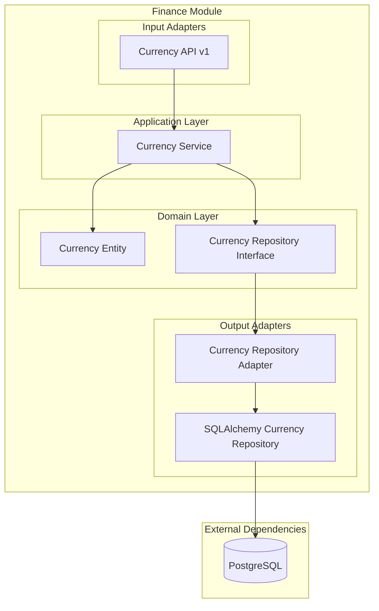

# Módulo Finance

## Descripción

El módulo **Finance** gestiona las operaciones financieras básicas del sistema, incluyendo la administración de monedas y tipos de cambio. Proporciona funcionalidades esenciales para el manejo de diferentes divisas en transacciones comerciales.

## Funcionalidades

- ✅ **Gestión de monedas** (crear, listar, actualizar, eliminar)
- ✅ **Códigos de moneda** estándar ISO 4217
- ✅ **Símbolos de moneda** para visualización
- ✅ **Asociación por país** para localización
- ✅ **API RESTful** para operaciones CRUD

## Arquitectura del Módulo



## Servicios Expuestos

```python
@property
def service(self) -> Dict[str, object]:
    return {"currency_service": self._container.currency_service}
```

### currency_service
- **Propósito**: Gestión completa de monedas
- **Funciones**: CRUD de monedas, validación de códigos ISO
- **Dependencias**: Ninguna (servicio independiente)

## API Endpoints

### Base Path: `/finance/v1/currency`

| Método | Endpoint | Descripción | Autenticación |
|--------|----------|-------------|---------------|
| GET | `/` | Listar todas las monedas | No |
| POST | `/` | Crear nueva moneda | Sí |
| GET | `/{id_currency}` | Obtener moneda específica | No |
| PUT | `/` | Actualizar moneda | Sí |
| DELETE | `/{id_currency}` | Eliminar moneda | Sí |

## Container de Dependencias

```python
class FinanceContainer(DeclarativeContainer):
    wiring_config = WiringConfiguration(packages=["."], auto_wire=True)
    
    # Repositorio SQLAlchemy como Singleton
    currency_repository = Singleton(CurrencySQLAlchemyRepository)
    
    # Adaptador del repositorio
    currency_repo_adapter = Factory(
        CurrencyRepositoryAdapter, 
        currency_repository=currency_repository
    )
    
    # Servicio de monedas
    currency_service = Factory(
        CurrencyService, 
        currency_repository=currency_repo_adapter
    )
```

### Características del Container

- **Repositorio singleton**: Una instancia compartida del repositorio
- **Adaptador factory**: Nueva instancia por inyección
- **Servicio independiente**: Sin dependencias externas

## Dependencias Externas

### Infraestructura
- **PostgreSQL**: Persistencia de datos de monedas

## Uso en Otros Módulos

### Obtener Lista de Monedas

```python
from shared.interfaces.service_locator import service_locator

# Obtener servicio de monedas
currency_service = service_locator.get_service("currency_service")

# Listar todas las monedas disponibles
currencies = await currency_service.get_currency_list()
print(f"Monedas disponibles: {len(currencies)}")
```

### Validar Moneda en Transacciones

```python
# En módulos de facturación o compras
async def validate_currency(self, currency_code: str):
    currency_service = service_locator.get_service("currency_service")
    
    # Buscar moneda por código
    currencies = await currency_service.get_currency_list()
    valid_currency = next(
        (c for c in currencies if c.code == currency_code), 
        None
    )
    
    if not valid_currency:
        raise ValueError(f"Moneda {currency_code} no válida")
    
    return valid_currency
```

### Inyección en FastAPI

```python
from shared.interfaces.service_locator import service_locator

@router.post("/transaction")
async def create_transaction(
    currency_service = Depends(service_locator.get_dependency("currency_service")),
    transaction_data: TransactionRequest,
):
    # Validar moneda antes de crear transacción
    currency = await currency_service.get_currency_by_id(
        transaction_data.currency_id
    )
    
    if not currency:
        raise HTTPException(404, "Moneda no encontrada")
    
    return {"message": "Transacción creada", "currency": currency.code}
```

## Modelo de Datos

### Currency Entity
```python
class Currency(SQLModel, table=True):
    id: int | None = Field(default=None, primary_key=True)
    name: str                    # ej: "Dólar Estadounidense"
    code: str                    # ej: "USD" (ISO 4217)
    symbol: str | None = None    # ej: "$"
    country: str | None = None   # ej: "Estados Unidos"
```

## Ejemplos de Uso

### Crear Nueva Moneda

```python
from modules.finance.adapter.input.api.v1.request import CurrencyCreateRequest

# Crear moneda
currency_request = CurrencyCreateRequest(
    name="Euro",
    code="EUR",
    symbol="€",
    country="Zona Euro"
)

currency_service = service_locator.get_service("currency_service")
new_currency = await currency_service.create_currency_and_save(currency_request)
```

### Buscar Moneda por Código

```python
# Buscar USD
currencies = await currency_service.get_currency_list()
usd_currency = next((c for c in currencies if c.code == "USD"), None)

if usd_currency:
    print(f"Moneda encontrada: {usd_currency.name} ({usd_currency.symbol})")
```

### Actualizar Información de Moneda

```python
from modules.finance.adapter.input.api.v1.request import CurrencyUpdateRequest

# Actualizar moneda existente
update_request = CurrencyUpdateRequest(
    id=1,
    name="Dólar Estadounidense",
    code="USD",
    symbol="$",
    country="Estados Unidos de América"
)

updated_currency = await currency_service.update_currency(update_request)
```

## Casos de Uso Comunes

### Integración con Facturación

```python
# En el módulo de facturación
class InvoiceService:
    async def create_invoice(self, invoice_data):
        currency_service = service_locator.get_service("currency_service")
        
        # Validar moneda de la factura
        currency = await currency_service.get_currency_by_id(
            invoice_data.currency_id
        )
        
        if not currency:
            raise ValueError("Moneda no válida para la factura")
        
        # Crear factura con moneda validada
        invoice = Invoice(
            amount=invoice_data.amount,
            currency_code=currency.code,
            currency_symbol=currency.symbol
        )
        
        return await self.repository.save(invoice)
```

### Conversión de Monedas (Futuro)

```python
# Preparado para futuras funcionalidades de conversión
class CurrencyService:
    async def convert_amount(self, amount: float, from_code: str, to_code: str):
        # Obtener monedas
        from_currency = await self.get_currency_by_code(from_code)
        to_currency = await self.get_currency_by_code(to_code)
        
        # Aquí se implementaría la lógica de conversión
        # usando tasas de cambio externas
        pass
```

## Extensiones Futuras

### Funcionalidades Planificadas

- **Tasas de cambio**: Integración con APIs de tipos de cambio
- **Conversión automática**: Cálculos de conversión entre monedas
- **Histórico de tasas**: Almacenamiento de tasas históricas
- **Monedas criptográficas**: Soporte para criptomonedas
- **Localización**: Formateo de monedas por región

### Integraciones Sugeridas

- **APIs externas**: CurrencyAPI, ExchangeRate-API
- **Módulo de reportes**: Para análisis financieros
- **Módulo de configuración**: Para tasas personalizadas