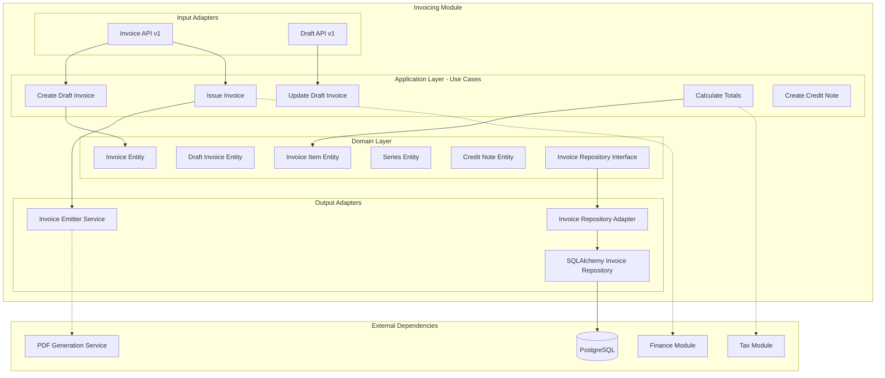

# Módulo Invoicing

## Descripción

El módulo **Invoicing** gestiona el proceso completo de facturación, desde la creación de borradores hasta la emisión de facturas oficiales. Incluye funcionalidades para notas de crédito, cancelaciones y gestión de series de facturación.

## Estado del Módulo

⚠️ **En Desarrollo**: Este módulo está en fase de desarrollo temprano. La documentación refleja la arquitectura planificada basada en las entidades de dominio existentes.

## Funcionalidades Planificadas

- 🔄 **Gestión de borradores** de facturas
- ✅ **Emisión de facturas** oficiales
- 📋 **Ítems de factura** con cálculos automáticos
- 🔢 **Series de facturación** numeradas
- 📝 **Notas de crédito** para devoluciones
- ❌ **Cancelación de facturas**
- 🧮 **Cálculo automático** de totales e impuestos
- 📊 **Reportes de facturación**

## Arquitectura del Módulo



## Casos de Uso Implementados

### CreateDraftInvoice
```python
@dataclass
class CreateDraftInvoice:
    repo: InvoiceRepository
    
    def __call__(self, dto: DraftInvoiceCreateDTO) -> DraftInvoice:
        draft = DraftInvoice(**dto.model_dump())
        return self.repo.save_draft(draft)
```

### IssueInvoice
```python
@dataclass
class IssueInvoice:
    repo: InvoiceRepository
    emitter: InvoiceEmitter
    
    def __call__(self, draft_id: int) -> Invoice:
        draft = self.repo.get_draft(draft_id)
        emitted = self.emitter.emit(draft)
        return self.repo.save_emitted(emitted)
```

### CalculateInvoiceTotals
```python
@dataclass
class CalculateInvoiceTotals:
    def __call__(self, draft: DraftInvoice) -> dict:
        subtotal = sum(item.amount for item in draft.items)
        tax = subtotal * 0.21  # IVA 21%
        total = subtotal + tax
        return {"subtotal": subtotal, "tax": tax, "total": total}
```

## Entidades de Dominio

### Invoice (Factura)
- **Estado**: Borrador, Emitida, Cancelada
- **Numeración**: Serie + número consecutivo
- **Totales**: Subtotal, impuestos, total
- **Relaciones**: Cliente, ítems, moneda

### Invoice Item (Ítem de Factura)
- **Producto/Servicio**: Descripción y código
- **Cantidad**: Unidades facturadas
- **Precio unitario**: Valor por unidad
- **Descuentos**: Aplicables al ítem
- **Impuestos**: Por ítem

### Series (Series de Facturación)
- **Prefijo**: Identificador de la serie (ej: "FAC")
- **Numeración**: Consecutivo automático
- **Configuración**: Formato y reglas

### Credit Note (Nota de Crédito)
- **Factura origen**: Referencia a factura original
- **Motivo**: Razón de la nota de crédito
- **Ítems**: Productos/servicios devueltos
- **Totales**: Montos a acreditar

## Servicios Planificados

```python
# Servicios que expondrá el módulo
@property
def service(self) -> Dict[str, object]:
    return {
        "invoicing.draft_service": self._container.draft_service,
        "invoicing.invoice_service": self._container.invoice_service,
        "invoicing.credit_note_service": self._container.credit_note_service,
        "invoicing.series_service": self._container.series_service,
    }
```

## API Endpoints Planificados

### Base Path: `/invoicing/v1`

| Método | Endpoint | Descripción | Estado |
|--------|----------|-------------|--------|
| GET | `/drafts` | Listar borradores | Planificado |
| POST | `/drafts` | Crear borrador | Planificado |
| PUT | `/drafts/{id}` | Actualizar borrador | Planificado |
| DELETE | `/drafts/{id}` | Eliminar borrador | Planificado |
| POST | `/drafts/{id}/issue` | Emitir factura | Planificado |
| GET | `/invoices` | Listar facturas | Planificado |
| GET | `/invoices/{id}` | Detalle de factura | Planificado |
| POST | `/invoices/{id}/cancel` | Cancelar factura | Planificado |
| POST | `/credit-notes` | Crear nota de crédito | Planificado |
| GET | `/series` | Gestionar series | Planificado |

## Dependencias Externas

### Módulos Requeridos

- **Finance Module**: Para validación de monedas
- **Tax Module**: Para cálculo de impuestos
- **User Module**: Para información de clientes
- **Provider Module**: Para proveedores (facturas de compra)

### Servicios Externos

- **PDF Generation**: Para generar facturas en PDF
- **Email Service**: Para envío de facturas
- **Electronic Invoicing**: Para facturación electrónica

## Uso Planificado en Otros Módulos

### Crear Factura desde Pedido

```python
# En módulo de ventas
from shared.interfaces.service_locator import service_locator

async def create_invoice_from_order(order_id: int):
    invoice_service = service_locator.get_service("invoicing.draft_service")
    
    # Crear borrador desde pedido
    draft = await invoice_service.create_from_order(order_id)
    
    # Emitir factura
    invoice = await invoice_service.issue_invoice(draft.id)
    
    return invoice
```

### Integración con Contabilidad

```python
# En módulo de contabilidad
async def process_invoice_accounting(invoice_id: int):
    invoice_service = service_locator.get_service("invoicing.invoice_service")
    
    # Obtener factura
    invoice = await invoice_service.get_by_id(invoice_id)
    
    # Crear asientos contables
    accounting_entries = [
        {"account": "1105", "debit": invoice.total},  # Cuentas por cobrar
        {"account": "4135", "credit": invoice.subtotal},  # Ventas
        {"account": "2408", "credit": invoice.tax_amount},  # IVA por pagar
    ]
    
    return accounting_entries
```

## Flujo de Facturación

### 1. Creación de Borrador

```python
# Crear borrador de factura
draft_data = {
    "customer_id": 123,
    "currency_id": 1,
    "items": [
        {
            "description": "Producto A",
            "quantity": 2,
            "unit_price": 100.00
        }
    ]
}

draft = await draft_service.create_draft(draft_data)
```

### 2. Cálculo de Totales

```python
# Calcular totales automáticamente
totals = await invoice_service.calculate_totals(draft.id)
# {"subtotal": 200.00, "tax": 42.00, "total": 242.00}
```

### 3. Emisión de Factura

```python
# Emitir factura oficial
invoice = await invoice_service.issue_invoice(draft.id)
print(f"Factura emitida: {invoice.series}-{invoice.number}")
```

### 4. Generación de PDF

```python
# Generar PDF de la factura
pdf_data = await invoice_service.generate_pdf(invoice.id)
```

## Configuración de Series

### Ejemplo de Configuración

```python
# Configurar series de facturación
series_config = {
    "sales": {
        "prefix": "FAC",
        "start_number": 1,
        "format": "FAC-{year}-{number:06d}"
    },
    "services": {
        "prefix": "SER",
        "start_number": 1,
        "format": "SER-{year}-{number:06d}"
    }
}
```

## Extensiones Futuras

### Funcionalidades Avanzadas

- **Facturación recurrente**: Para suscripciones
- **Facturación electrónica**: Integración con SUNAT/DIAN
- **Multi-moneda**: Facturas en diferentes divisas
- **Descuentos avanzados**: Por volumen, promocionales
- **Plantillas**: Diseños personalizables
- **Workflow de aprobación**: Para facturas grandes

### Integraciones

- **CRM**: Sincronización con datos de clientes
- **Inventario**: Actualización automática de stock
- **Contabilidad**: Asientos automáticos
- **Reportes**: Dashboard de facturación
- **Pagos**: Integración con pasarelas de pago

## Notas de Desarrollo

⚠️ **Estado Actual**: El módulo está en desarrollo inicial. Las entidades de dominio están definidas pero falta:

1. Implementación completa del container
2. Adaptadores de persistencia
3. APIs REST
4. Servicios de aplicación
5. Tests unitarios

La documentación actual sirve como guía para el desarrollo futuro del módulo.