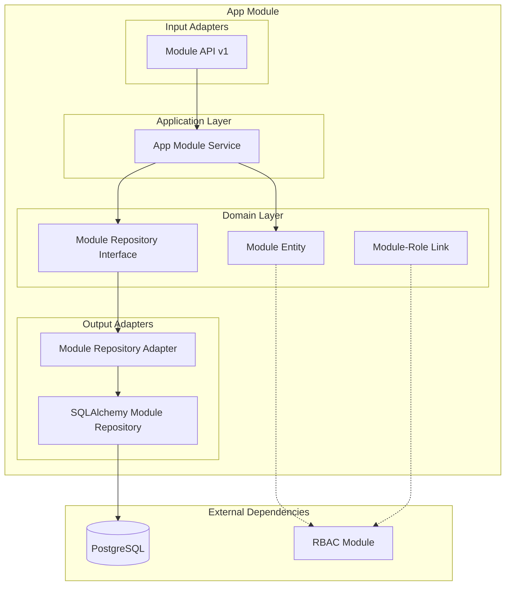

# Módulo App Module

## Descripción

El módulo **App Module** gestiona la información de los módulos del sistema, proporcionando un registro centralizado de todos los módulos disponibles y sus configuraciones. Es fundamental para el sistema RBAC y la gestión de permisos por módulo.

## Funcionalidades

- ✅ **Registro de módulos** del sistema
- ✅ **Gestión de tokens** de módulo
- ✅ **Relación con roles** RBAC
- ✅ **Listado paginado** de módulos
- ✅ **Búsqueda por token** de módulo
- ✅ **Integración con RBAC** para permisos

## Arquitectura del Módulo



## Servicios Expuestos

```python
@property
def service(self) -> Dict[str, object]:
    return {"app_module_service": self._container.service}
```

### app_module_service
- **Propósito**: Gestión completa de módulos del sistema
- **Funciones**: CRUD de módulos, búsqueda por token, relación con roles
- **Dependencias**: Ninguna (servicio base del sistema)

## API Endpoints

### Base Path: `/modules/v1/modules`

| Método | Endpoint | Descripción | Autenticación |
|--------|----------|-------------|---------------|
| GET | `/` | Listar módulos (paginado) | Sí |

### Parámetros de Consulta

- **limit**: Número de resultados por página (1-50, default: 10)
- **page**: Página a consultar (default: 0)

## Container de Dependencias

```python
class AppModuleContainer(DeclarativeContainer):
    wiring_config = WiringConfiguration(packages=["."], auto_wire=True)
    
    # Repositorio SQLAlchemy como Singleton
    repository = Singleton(AppModuleSQLAlchemyRepository)
    
    # Adaptador del repositorio
    repository_adapter = Factory(
        AppModuleRepositoryAdapter, 
        module_repository=repository
    )
    
    # Servicio de módulos
    service = Factory(
        AppModuleService, 
        app_module_repository=repository_adapter
    )
```

### Características del Container

- **Repositorio singleton**: Una instancia compartida
- **Servicio independiente**: Sin dependencias externas
- **Base del sistema**: Otros módulos dependen de este

## Dependencias Externas

### Infraestructura
- **PostgreSQL**: Persistencia de información de módulos

### Módulos que lo Utilizan
- **RBAC Module**: Para asociar roles con módulos
- **Todos los módulos**: Para registro y validación

## Uso en Otros Módulos

### Obtener Módulos por Token

```python
from shared.interfaces.service_locator import service_locator

# Obtener servicio de módulos
module_service = service_locator.get_service("app_module_service")

# Buscar módulos por tokens
token_modules = ["users", "finance", "invoicing"]
modules = await module_service.get_modules_by_token_name(token_modules)

for module in modules:
    print(f"Módulo: {module.name} - Token: {module.token}")
```

### Validar Existencia de Módulo

```python
# En el sistema RBAC para validar módulos
async def validate_module_exists(self, module_token: str):
    module_service = service_locator.get_service("app_module_service")
    
    # Buscar módulo por token
    modules = await module_service.get_modules_by_token_name([module_token])
    
    if not modules:
        raise ValueError(f"Módulo {module_token} no existe")
    
    return modules[0]
```

### Inyección en FastAPI

```python
from shared.interfaces.service_locator import service_locator

@router.get("/module-info")
async def get_module_info(
    module_service = Depends(service_locator.get_dependency("app_module_service")),
    module_token: str = Query(...),
):
    # Buscar módulo por token
    modules = await module_service.get_modules_by_token_name([module_token])
    
    if not modules:
        raise HTTPException(404, "Módulo no encontrado")
    
    return modules[0]
```

## Modelo de Datos

### Module Entity
```python
class Module(SQLModel, table=True):
    id: int | None = Field(default=None, primary_key=True)
    name: str                    # ej: "User Management"
    token: str                   # ej: "users" (identificador único)
    description: str | None      # ej: "Gestión de usuarios del sistema"
    
    # Relación con roles RBAC
    roles: List['Role'] = Relationship(
        back_populates='modules', 
        link_model=ModuleRoleLink
    )
```

### Module-Role Link
```python
class ModuleRoleLink(SQLModel, table=True):
    fk_module: int = Field(primary_key=True, foreign_key='module.id')
    fk_role: int = Field(primary_key=True, foreign_key='role.id')
```

## Ejemplos de Uso

### Listar Módulos del Sistema

```python
# Obtener lista paginada de módulos
module_service = service_locator.get_service("app_module_service")

# Primera página, 10 resultados
modules = await module_service.get_module_list(limit=10, page=0)

print(f"Módulos encontrados: {len(modules)}")
for module in modules:
    print(f"- {module.name} ({module.token})")
```

### Buscar Módulos Específicos

```python
# Buscar módulos por tokens específicos
target_tokens = ["users", "finance", "rbac"]
modules = await module_service.get_modules_by_token_name(target_tokens)

# Crear diccionario para acceso rápido
module_dict = {m.token: m for m in modules}

if "users" in module_dict:
    user_module = module_dict["users"]
    print(f"Módulo de usuarios: {user_module.name}")
```

## Integración con RBAC

### Obtener Roles de Módulos

```python
# En el servicio RBAC
class RoleService:
    async def get_all_roles_from_modules(self, module_ids: List[int]):
        # Obtener módulos
        module_service = service_locator.get_service("app_module_service")
        
        # Los módulos ya tienen la relación con roles
        # Esta funcionalidad se implementa en el repositorio
        return await self.repository.get_roles_by_module_ids(module_ids)
```

### Asignar Roles a Módulos

```python
# Crear rol específico para un módulo
async def create_module_role(module_token: str, role_data: dict):
    module_service = service_locator.get_service("app_module_service")
    role_service = service_locator.get_service("rbac.role_service")
    
    # Obtener módulo
    modules = await module_service.get_modules_by_token_name([module_token])
    if not modules:
        raise ValueError(f"Módulo {module_token} no encontrado")
    
    module = modules[0]
    
    # Crear rol asociado al módulo
    role_data["module_id"] = module.id
    role = await role_service.create_role(role_data)
    
    return role
```

## Casos de Uso Comunes

### Registro Automático de Módulos

```python
# Al inicializar el sistema, registrar módulos automáticamente
SYSTEM_MODULES = [
    {
        "name": "User Management",
        "token": "users",
        "description": "Gestión de usuarios del sistema"
    },
    {
        "name": "Finance",
        "token": "finance",
        "description": "Gestión financiera y monedas"
    },
    {
        "name": "RBAC",
        "token": "rbac",
        "description": "Control de acceso basado en roles"
    },
    {
        "name": "Invoicing",
        "token": "invoicing",
        "description": "Sistema de facturación"
    }
]

async def register_system_modules():
    module_service = service_locator.get_service("app_module_service")
    
    for module_data in SYSTEM_MODULES:
        # Verificar si ya existe
        existing = await module_service.get_modules_by_token_name([module_data["token"]])
        
        if not existing:
            await module_service.create_module(module_data)
            print(f"Módulo {module_data['name']} registrado")
```

### Validación de Permisos por Módulo

```python
# Middleware para validar permisos por módulo
async def validate_module_permission(request, module_token: str, permission: str):
    module_service = service_locator.get_service("app_module_service")
    role_service = service_locator.get_service("rbac.role_service")
    
    # Verificar que el módulo existe
    modules = await module_service.get_modules_by_token_name([module_token])
    if not modules:
        raise HTTPException(404, f"Módulo {module_token} no encontrado")
    
    # Verificar permisos del usuario en el módulo
    user_id = request.state.user.id
    has_permission = await role_service.user_has_permission(
        user_id, 
        f"{module_token}.{permission}"
    )
    
    if not has_permission:
        raise HTTPException(403, "Sin permisos en este módulo")
```

## Configuración del Sistema

### Inicialización de Módulos

```python
# En el startup de la aplicación
async def initialize_modules():
    """Inicializar módulos del sistema al arrancar"""
    module_service = service_locator.get_service("app_module_service")
    
    # Registrar módulos base
    await register_system_modules()
    
    # Verificar integridad
    all_modules = await module_service.get_module_list(limit=100, page=0)
    print(f"Sistema inicializado con {len(all_modules)} módulos")
```

### Health Check de Módulos

```python
@router.get("/health/modules")
async def check_modules_health():
    module_service = service_locator.get_service("app_module_service")
    
    try:
        modules = await module_service.get_module_list(limit=1, page=0)
        return {
            "status": "healthy",
            "modules_available": True,
            "message": "Módulos funcionando correctamente"
        }
    except Exception as e:
        return {
            "status": "unhealthy",
            "modules_available": False,
            "error": str(e)
        }
```

## Extensiones Futuras

### Funcionalidades Planificadas

- **Versionado de módulos**: Control de versiones
- **Dependencias entre módulos**: Gestión de dependencias
- **Estado de módulos**: Activo/Inactivo/Mantenimiento
- **Configuración por módulo**: Settings específicos
- **Métricas de uso**: Estadísticas de utilización
- **Auto-discovery**: Detección automática de módulos

### Integraciones Sugeridas

- **Logging**: Logs específicos por módulo
- **Monitoring**: Métricas de rendimiento por módulo
- **Configuration**: Configuración dinámica
- **Documentation**: Documentación automática de APIs