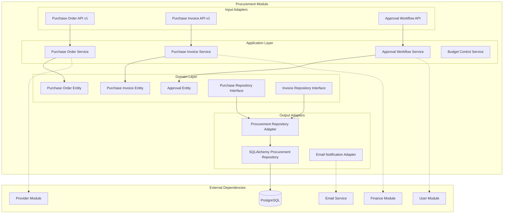

# Módulo Procurement

## Descripción

El módulo **Procurement** gestiona el proceso completo de compras y adquisiciones, desde la creación de órdenes de compra hasta el procesamiento de facturas de proveedores. Integra con el módulo de proveedores para un flujo completo de procurement.

## Estado del Módulo

⚠️ **En Desarrollo**: Este módulo está en fase de desarrollo temprano. La documentación refleja la arquitectura planificada basada en las entidades de dominio identificadas.

## Funcionalidades Planificadas

- 📋 **Órdenes de compra** (crear, aprobar, enviar)
- 📄 **Facturas de compra** (recibir, validar, procesar)
- 🔄 **Flujo de aprobación** multinivel
- 📊 **Seguimiento de pedidos** y entregas
- 💰 **Control presupuestario** por departamento
- 📈 **Reportes de compras** y análisis de gastos
- 🔗 **Integración con proveedores** y catálogos
- ⚖️ **Gestión de contratos** y acuerdos marco

## Arquitectura del Módulo



## Entidades de Dominio Planificadas

### Purchase Order (Orden de Compra)
- **Información básica**: Número, fecha, proveedor
- **Estado**: Borrador, Enviada, Aprobada, Recibida, Cancelada
- **Ítems**: Productos/servicios solicitados
- **Totales**: Subtotal, impuestos, total
- **Aprobaciones**: Flujo de aprobación multinivel
- **Entregas**: Fechas programadas y reales

### Purchase Invoice (Factura de Compra)
- **Referencia**: Orden de compra asociada
- **Proveedor**: Información del emisor
- **Validación**: Comparación con orden original
- **Estado**: Recibida, Validada, Aprobada, Pagada
- **Discrepancias**: Diferencias con la orden
- **Contabilización**: Asientos contables

## Servicios Planificados

```python
# Servicios que expondrá el módulo
@property
def service(self) -> Dict[str, object]:
    return {
        "procurement.purchase_order_service": self._container.purchase_order_service,
        "procurement.purchase_invoice_service": self._container.purchase_invoice_service,
        "procurement.approval_service": self._container.approval_service,
        "procurement.budget_service": self._container.budget_service,
    }
```

## API Endpoints Planificados

### Base Path: `/procurement/v1`

| Método | Endpoint | Descripción | Estado |
|--------|----------|-------------|--------|
| GET | `/purchase-orders` | Listar órdenes de compra | Planificado |
| POST | `/purchase-orders` | Crear orden de compra | Planificado |
| GET | `/purchase-orders/{id}` | Detalle de orden | Planificado |
| PUT | `/purchase-orders/{id}` | Actualizar orden | Planificado |
| POST | `/purchase-orders/{id}/submit` | Enviar para aprobación | Planificado |
| POST | `/purchase-orders/{id}/approve` | Aprobar orden | Planificado |
| POST | `/purchase-orders/{id}/reject` | Rechazar orden | Planificado |
| GET | `/purchase-invoices` | Listar facturas de compra | Planificado |
| POST | `/purchase-invoices` | Registrar factura | Planificado |
| POST | `/purchase-invoices/{id}/validate` | Validar factura | Planificado |
| GET | `/approvals/pending` | Aprobaciones pendientes | Planificado |
| GET | `/reports/spending` | Reportes de gastos | Planificado |

## Dependencias Externas

### Módulos Requeridos

- **Provider Module**: Para información de proveedores
- **Finance Module**: Para monedas y cálculos financieros
- **User Module**: Para usuarios y aprobadores
- **RBAC Module**: Para permisos de aprobación

### Servicios Externos

- **Email Service**: Para notificaciones de aprobación
- **PDF Generation**: Para generar órdenes de compra
- **File Storage**: Para adjuntos y documentos

## Flujo de Procurement Planificado

### 1. Creación de Orden de Compra

```python
# Crear nueva orden de compra
purchase_order_data = {
    "provider_id": 123,
    "currency_id": 1,
    "department": "IT",
    "requested_by": "user-456",
    "items": [
        {
            "description": "Laptop Dell",
            "quantity": 5,
            "unit_price": 1200.00,
            "delivery_date": "2024-02-15"
        }
    ],
    "notes": "Urgente para nuevo equipo"
}

purchase_service = service_locator.get_service("procurement.purchase_order_service")
order = await purchase_service.create_purchase_order(purchase_order_data)
```

### 2. Flujo de Aprobación

```python
# Enviar orden para aprobación
approval_service = service_locator.get_service("procurement.approval_service")

# Determinar aprobadores según monto y departamento
approvers = await approval_service.get_required_approvers(
    amount=order.total,
    department=order.department
)

# Iniciar flujo de aprobación
approval_flow = await approval_service.start_approval_flow(
    order_id=order.id,
    approvers=approvers
)
```

### 3. Procesamiento de Facturas

```python
# Registrar factura de proveedor
invoice_data = {
    "purchase_order_id": order.id,
    "provider_invoice_number": "PROV-2024-001",
    "invoice_date": "2024-01-20",
    "amount": 6000.00,
    "currency_id": 1,
    "items": [
        {
            "description": "Laptop Dell",
            "quantity": 5,
            "unit_price": 1200.00
        }
    ]
}

invoice_service = service_locator.get_service("procurement.purchase_invoice_service")
invoice = await invoice_service.register_purchase_invoice(invoice_data)

# Validar contra orden original
validation = await invoice_service.validate_against_order(invoice.id)
```

## Uso en Otros Módulos

### Integración con Contabilidad

```python
# En módulo de contabilidad
async def process_purchase_accounting(purchase_invoice_id: int):
    invoice_service = service_locator.get_service("procurement.purchase_invoice_service")
    
    # Obtener factura de compra
    invoice = await invoice_service.get_by_id(purchase_invoice_id)
    
    # Crear asientos contables
    accounting_entries = [
        {"account": "1435", "debit": invoice.total},      # Inventarios
        {"account": "2408", "debit": invoice.tax_amount}, # IVA por cobrar
        {"account": "2205", "credit": invoice.total + invoice.tax_amount}, # Cuentas por pagar
    ]
    
    return accounting_entries
```

### Control Presupuestario

```python
# Verificar presupuesto antes de aprobar
async def check_budget_availability(order_id: int):
    budget_service = service_locator.get_service("procurement.budget_service")
    purchase_service = service_locator.get_service("procurement.purchase_order_service")
    
    # Obtener orden
    order = await purchase_service.get_by_id(order_id)
    
    # Verificar presupuesto disponible
    budget_check = await budget_service.check_availability(
        department=order.department,
        amount=order.total,
        period="2024-01"
    )
    
    if not budget_check.available:
        raise BudgetExceededException(
            f"Presupuesto insuficiente. Disponible: {budget_check.remaining}"
        )
    
    return budget_check
```

## Configuración de Aprobaciones

### Matriz de Aprobación

```python
# Configuración de niveles de aprobación
APPROVAL_MATRIX = {
    "IT": {
        "0-1000": ["supervisor"],
        "1000-5000": ["supervisor", "manager"],
        "5000+": ["supervisor", "manager", "director"]
    },
    "Marketing": {
        "0-500": ["supervisor"],
        "500-2000": ["supervisor", "manager"],
        "2000+": ["supervisor", "manager", "director"]
    },
    "General": {
        "0-100": [],  # Auto-aprobado
        "100-1000": ["supervisor"],
        "1000+": ["supervisor", "manager"]
    }
}

async def get_required_approvers(department: str, amount: float):
    rules = APPROVAL_MATRIX.get(department, APPROVAL_MATRIX["General"])
    
    for amount_range, approvers in rules.items():
        if matches_amount_range(amount, amount_range):
            return approvers
    
    return rules["1000+"]  # Default para montos altos
```

## Reportes y Analytics

### Dashboard de Compras

```python
# Métricas de procurement
async def get_procurement_metrics(period: str):
    purchase_service = service_locator.get_service("procurement.purchase_order_service")
    
    metrics = {
        "total_orders": await purchase_service.count_orders(period),
        "total_amount": await purchase_service.sum_orders_amount(period),
        "avg_approval_time": await purchase_service.avg_approval_time(period),
        "top_providers": await purchase_service.get_top_providers(period, limit=10),
        "spending_by_department": await purchase_service.spending_by_department(period),
        "pending_approvals": await purchase_service.count_pending_approvals()
    }
    
    return metrics
```

### Análisis de Proveedores

```python
# Evaluación de desempeño de proveedores
async def analyze_provider_performance(provider_id: int, period: str):
    purchase_service = service_locator.get_service("procurement.purchase_order_service")
    invoice_service = service_locator.get_service("procurement.purchase_invoice_service")
    
    analysis = {
        "total_orders": await purchase_service.count_by_provider(provider_id, period),
        "total_amount": await purchase_service.sum_by_provider(provider_id, period),
        "on_time_delivery": await purchase_service.on_time_delivery_rate(provider_id, period),
        "invoice_accuracy": await invoice_service.accuracy_rate(provider_id, period),
        "avg_order_value": await purchase_service.avg_order_value(provider_id, period)
    }
    
    return analysis
```

## Integraciones Futuras

### ERP Integration

```python
# Sincronización con ERP externo
async def sync_with_erp():
    erp_service = service_locator.get_service("yiqi_erp.integration_service")
    purchase_service = service_locator.get_service("procurement.purchase_order_service")
    
    # Obtener órdenes aprobadas pendientes de sincronización
    pending_orders = await purchase_service.get_pending_erp_sync()
    
    for order in pending_orders:
        # Enviar al ERP
        erp_response = await erp_service.create_purchase_order(order)
        
        # Actualizar estado
        await purchase_service.mark_erp_synced(order.id, erp_response.erp_id)
```

### Supplier Portal

```python
# Portal para proveedores
@router.get("/supplier-portal/orders")
async def get_supplier_orders(
    provider_id: int = Depends(get_current_provider),
    purchase_service = Depends(service_locator.get_dependency("procurement.purchase_order_service"))
):
    # Órdenes del proveedor
    orders = await purchase_service.get_orders_by_provider(provider_id)
    
    return {
        "orders": orders,
        "total": len(orders),
        "pending_delivery": len([o for o in orders if o.status == "approved"])
    }
```

## Extensiones Futuras

### Funcionalidades Avanzadas

- **Catálogo de productos**: Productos pre-aprobados
- **Contratos marco**: Acuerdos de precios
- **Licitaciones**: Proceso de cotización
- **Recepción de mercancías**: Control de entregas
- **Devoluciones**: Gestión de returns
- **Analytics avanzados**: ML para predicciones

### Automatizaciones

- **Auto-aprobación**: Para montos pequeños
- **Matching automático**: Facturas vs órdenes
- **Alertas inteligentes**: Retrasos y discrepancias
- **Integración bancaria**: Pagos automáticos

## Notas de Desarrollo

⚠️ **Estado Actual**: El módulo está en desarrollo inicial. Las entidades de dominio están identificadas pero falta:

1. Implementación completa de entidades
2. Servicios de aplicación
3. Adaptadores de persistencia
4. APIs REST
5. Flujos de aprobación
6. Tests unitarios

La documentación actual sirve como guía arquitectural para el desarrollo del módulo de procurement.