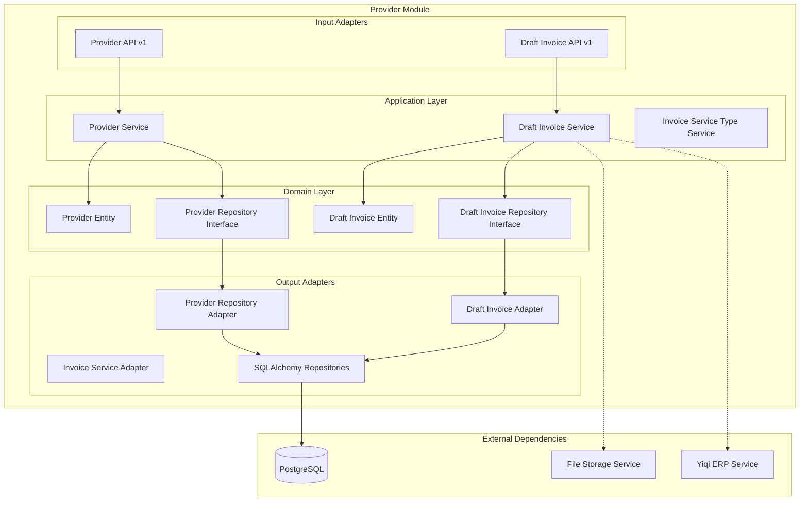

# Módulo Provider

## Descripción

El módulo **Provider** gestiona toda la información relacionada con proveedores del sistema. Incluye el CRUD de proveedores, gestión de facturas borrador, servicios de facturación y integración con sistemas ERP externos para sincronización de datos.

## Funcionalidades

- ✅ **CRUD completo de proveedores** (crear, leer, actualizar, eliminar)
- ✅ **Gestión de facturas borrador** (draft invoices)
- ✅ **Servicios de facturación** por tipo
- ✅ **Integración con ERP externo** (Yiqi)
- ✅ **Almacenamiento de archivos** adjuntos
- ✅ **Validación de datos** de proveedores
- ✅ **Búsqueda y filtrado** avanzado

## Arquitectura del Módulo



## Servicios Expuestos

```python
@property
def service(self) -> Dict[str, object]:
    return {
        "provider_service": self._container.provider_service,
        "draft_invoice_service": self._container.draft_invoice_service,
    }
```

### provider_service
- **Propósito**: Gestión completa de proveedores
- **Funciones**: CRUD, búsquedas, validaciones
- **Dependencias**: Ninguna (servicio independiente)

### draft_invoice_service
- **Propósito**: Gestión de facturas borrador
- **Funciones**: Crear, procesar, almacenar archivos
- **Dependencias**: File Storage Service, Yiqi ERP Service

## API Endpoints

### Proveedores - Base Path: `/providers/v1/providers`

| Método | Endpoint | Descripción | Autenticación |
|--------|----------|-------------|---------------|
| GET | `/` | Listar proveedores (paginado) | Sí |
| POST | `/` | Crear nuevo proveedor | Sí |
| GET | `/{id_provider}` | Obtener proveedor por ID | Sí |
| PUT | `/` | Actualizar proveedor | Sí |
| DELETE | `/{id_provider}` | Eliminar proveedor | Sí |

### Facturas Borrador - Base Path: `/providers/v1/draft_invoice`

| Método | Endpoint | Descripción | Autenticación |
|--------|----------|-------------|---------------|
| GET | `/` | Listar facturas borrador | Sí |
| POST | `/` | Crear factura borrador | Sí |
| GET | `/{invoice_id}` | Obtener factura específica | Sí |
| PUT | `/{invoice_id}` | Actualizar factura | Sí |
| DELETE | `/{invoice_id}` | Eliminar factura | Sí |

## Ejemplos de Uso

### Gestión de Proveedores

#### Crear Proveedor
```python
# Endpoint: POST /providers/v1/providers
@provider_router.post("")
@inject
async def create_provider(
    command: ProviderCreateRequest,
    service: ProviderService = Depends(Provide[ProviderContainer.provider_service]),
):
    provider = await service.create_provider(command)
    return await service.save_provider(provider)
```

**Request:**
```json
{
    "name": "Proveedor ABC S.A.",
    "tax_id": "12345678901",
    "email": "contacto@proveedorabc.com",
    "phone": "+1234567890",
    "address": {
        "street": "Calle Principal 123",
        "city": "Ciudad",
        "country": "País",
        "postal_code": "12345"
    },
    "contact_person": "Juan Pérez",
    "payment_terms": "30 días",
    "active": true
}
```

#### Listar Proveedores
```python
# Endpoint: GET /providers/v1/providers
@provider_router.get("")
@inject
async def get_all_providers(
    limit: int = Query(default=10, ge=1, le=50),
    page: int = Query(default=0),
    service: ProviderService = Depends(Provide[ProviderContainer.provider_service]),
):
    return await service.get_all_providers(limit, page)
```

**Response:**
```json
{
    "providers": [
        {
            "id": 1,
            "name": "Proveedor ABC S.A.",
            "tax_id": "12345678901",
            "email": "contacto@proveedorabc.com",
            "active": true,
            "created_at": "2024-01-15T10:30:00Z"
        }
    ],
    "total": 25,
    "page": 0,
    "limit": 10
}
```

### Gestión de Facturas Borrador

#### Crear Factura Borrador
```python
# Endpoint: POST /providers/v1/draft_invoice
@draft_invoice_router.post("")
@inject
async def create_draft_invoice(
    command: CreateDraftInvoiceRequest,
    service: DraftPurchaseInvoiceService = Depends(Provide[ProviderContainer.draft_invoice_service]),
):
    return await service.create_draft_invoice(command)
```

**Request:**
```json
{
    "provider_id": 1,
    "invoice_number": "DRAFT-2024-001",
    "amount": 1500.00,
    "currency": "USD",
    "description": "Servicios de consultoría",
    "due_date": "2024-02-15",
    "items": [
        {
            "description": "Consultoría técnica",
            "quantity": 10,
            "unit_price": 150.00,
            "total": 1500.00
        }
    ],
    "attachments": ["file1.pdf", "file2.xlsx"]
}
```

## Container de Dependencias

```python
class ProviderContainer(DeclarativeContainer):
    wiring_config = WiringConfiguration(packages=["."], auto_wire=True)
    
    # Servicio ERP externo via service_locator
    yiqi_service: Provider = service_locator.get_service("yiqi_service")
    
    # Repositorios SQLAlchemy como Singleton
    provider_repo = Singleton(ProviderSQLAlchemyRepository)
    draft_invoice_repo = Singleton(DraftPurchaseInvoiceSQLAlchemyRepository)
    invoice_service_repo = Singleton(PurchaseInvoiceServiceSQLAlchemyRepository)
    
    # Adaptadores como Factory
    provider_repo_adapter = Factory(
        ProviderRepositoryAdapter, 
        provider_repository=provider_repo
    )
    
    draft_invoice_repo_adapter = Factory(
        DraftPurchaseInvoiceAdapter,
        draft_purchase_invoice_repository=draft_invoice_repo,
    )
    
    # Servicios principales
    provider_service = Factory(
        ProviderService,
        provider_repository=provider_repo_adapter,
    )
    
    draft_invoice_service = Factory(
        DraftPurchaseInvoiceService,
        draft_purchase_invoice_repository=draft_invoice_repo_adapter,
        file_storage_service=service_locator.get_dependency("file_storage_service"),
        yiqi_service=yiqi_service,
    )
```

### Características del Container

- **Múltiples repositorios**: Separados por entidad (provider, draft_invoice, invoice_service)
- **Servicios externos**: Integración con File Storage y Yiqi ERP
- **Patrón adaptador**: Separación clara entre dominio e infraestructura

## Dependencias Externas

### Servicios Utilizados via Service Locator

```python
# En el container
file_storage_service=service_locator.get_dependency("file_storage_service")
yiqi_service=service_locator.get_service("yiqi_service")
```

- **File Storage Service**: Para almacenar archivos adjuntos de facturas
- **Yiqi ERP Service**: Para sincronización con sistema ERP externo

### Infraestructura
- **PostgreSQL**: Base de datos principal para persistencia
- **File System**: A través del File Storage Service

## Uso en Otros Módulos

### Obtener Información de Proveedores

```python
# En el módulo Finance
from shared.interfaces.service_locator import service_locator

# Obtener servicio de proveedores
provider_service = service_locator.get_service("provider_service")

# Buscar proveedor por ID
provider = await provider_service.get_provider_by_id(provider_id)

# Validar que el proveedor esté activo
if not provider.active:
    raise ValueError("Provider is inactive")
```

### Integración con Facturación

```python
# En el módulo Invoicing
async def create_invoice_from_provider(provider_id: int, amount: float):
    provider_service = service_locator.get_service("provider_service")
    
    # Obtener datos del proveedor
    provider = await provider_service.get_provider_by_id(provider_id)
    
    # Crear factura con datos del proveedor
    invoice = Invoice(
        provider_name=provider.name,
        provider_tax_id=provider.tax_id,
        provider_address=provider.address,
        amount=amount
    )
    
    return await invoice_service.create_invoice(invoice)
```

## Modelos de Datos

### Provider Entity
```python
@dataclass
class Provider:
    id: Optional[int] = None
    name: str = ""
    tax_id: str = ""
    email: str = ""
    phone: str = ""
    address: dict = field(default_factory=dict)
    contact_person: str = ""
    payment_terms: str = ""
    active: bool = True
    created_at: Optional[datetime] = None
    updated_at: Optional[datetime] = None
```

### Draft Invoice Entity
```python
@dataclass
class DraftPurchaseInvoice:
    id: Optional[int] = None
    provider_id: int = 0
    invoice_number: str = ""
    amount: Decimal = Decimal('0.00')
    currency: str = "USD"
    description: str = ""
    due_date: Optional[date] = None
    status: str = "draft"  # draft, processed, cancelled
    items: List[dict] = field(default_factory=list)
    attachments: List[str] = field(default_factory=list)
    created_at: Optional[datetime] = None
```

## Integración con ERP Externo

### Sincronización con Yiqi ERP

```python
# En DraftPurchaseInvoiceService
class DraftPurchaseInvoiceService:
    async def sync_with_erp(self, draft_invoice_id: int):
        # Obtener factura borrador
        draft_invoice = await self.repository.get_by_id(draft_invoice_id)
        
        # Sincronizar con Yiqi ERP
        erp_result = await self.yiqi_service.sync_invoice(draft_invoice)
        
        if erp_result.success:
            # Actualizar estado
            draft_invoice.status = "synced"
            draft_invoice.erp_reference = erp_result.reference_id
            await self.repository.save(draft_invoice)
        
        return erp_result
```

### Manejo de Archivos

```python
# Almacenamiento de archivos adjuntos
async def attach_file_to_invoice(self, invoice_id: int, file_data: bytes, filename: str):
    # Almacenar archivo
    file_result = await self.file_storage_service.upload_file(
        file_data, 
        filename, 
        folder=f"invoices/{invoice_id}"
    )
    
    # Asociar archivo con factura
    draft_invoice = await self.repository.get_by_id(invoice_id)
    draft_invoice.attachments.append(file_result.file_path)
    
    await self.repository.save(draft_invoice)
    return file_result
```

## Testing

### Test de Creación de Proveedor

```python
@pytest.mark.asyncio
async def test_create_provider():
    # Mock del repositorio
    mock_repository = AsyncMock()
    mock_repository.save.return_value = Provider(
        id=1,
        name="Test Provider",
        tax_id="123456789"
    )
    
    # Test del servicio
    service = ProviderService(mock_repository)
    command = ProviderCreateRequest(
        name="Test Provider",
        tax_id="123456789",
        email="test@provider.com"
    )
    
    result = await service.create_provider(command)
    assert result.name == "Test Provider"
```

### Test de API

```python
@pytest.mark.asyncio
async def test_get_providers_endpoint():
    response = await client.get("/providers/v1/providers?limit=5&page=0")
    
    assert response.status_code == 200
    data = response.json()
    assert "providers" in data
    assert len(data["providers"]) <= 5
```

## Configuración

### Variables de Entorno

```env
# Provider Module Configuration
PROVIDER_DEFAULT_CURRENCY=USD
PROVIDER_DEFAULT_PAYMENT_TERMS=30
PROVIDER_FILE_UPLOAD_MAX_SIZE=10MB

# ERP Integration
YIQI_ERP_ENABLED=true
YIQI_ERP_SYNC_INTERVAL=3600

# File Storage
FILE_STORAGE_PROVIDER_FOLDER=providers
FILE_STORAGE_INVOICE_FOLDER=invoices
```

## Validaciones de Negocio

### Validación de Proveedores

```python
# Validaciones implementadas
- Tax ID único por proveedor
- Email válido
- Teléfono en formato internacional
- Dirección completa requerida
- Términos de pago válidos
```

### Validación de Facturas

```python
# Validaciones de facturas borrador
- Proveedor debe existir y estar activo
- Monto debe ser positivo
- Fecha de vencimiento futura
- Items deben sumar el total
- Archivos adjuntos válidos
```

## Seguridad

### Permisos Requeridos

- **Crear proveedor**: `providers.create`
- **Leer proveedores**: `providers.read`
- **Actualizar proveedor**: `providers.update`
- **Eliminar proveedor**: `providers.delete`
- **Gestionar facturas**: `providers.invoices.manage`

### Validaciones de Seguridad

- Sanitización de inputs
- Validación de archivos adjuntos
- Verificación de permisos por operación
- Auditoría de cambios importantes

## Troubleshooting

### Problemas Comunes

1. **Proveedor duplicado**
   - Verificar Tax ID único
   - Revisar validaciones de email

2. **Error de sincronización ERP**
   - Verificar conectividad con Yiqi ERP
   - Revisar logs de sincronización

3. **Archivos no se suben**
   - Verificar File Storage Service
   - Confirmar permisos de escritura

### Logs Útiles

```python
# Habilitar logs del módulo provider
import logging
logging.getLogger('modules.provider').setLevel(logging.DEBUG)
```

## Roadmap

### Funcionalidades Futuras

- [ ] **Categorización** de proveedores
- [ ] **Evaluación** y rating de proveedores
- [ ] **Contratos** y acuerdos
- [ ] **Historial de pagos**
- [ ] **Integración con contabilidad**
- [ ] **Notificaciones** automáticas
- [ ] **Dashboard** de proveedores
- [ ] **API de terceros** para validación fiscal