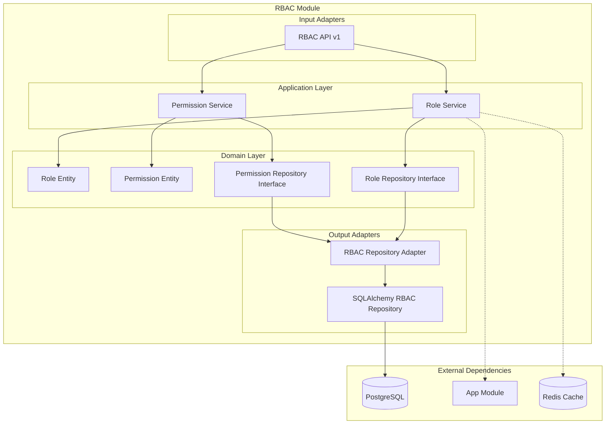

# Módulo RBAC

## Descripción

El módulo **RBAC** (Role-Based Access Control) implementa un sistema completo de control de acceso basado en roles. Gestiona roles, permisos y la asignación de estos a usuarios, proporcionando un sistema de autorización granular para toda la aplicación.

## Funcionalidades

- ✅ **Gestión de roles** (crear, listar, actualizar, eliminar)
- ✅ **Gestión de permisos** por módulo
- ✅ **Asignación de roles** a usuarios
- ✅ **Verificación de permisos** en tiempo real
- ✅ **Roles jerárquicos** con herencia de permisos
- ✅ **Integración con módulos** del sistema
- ✅ **Cache de permisos** para performance
- ✅ **Auditoría** de cambios de roles

## Arquitectura del Módulo



## Servicios Expuestos

```python
@property
def service(self) -> Dict[str, object]:
    return {
        "rbac.role_service": self._container.role_service,
        "rbac.permission_service": self._container.permission_service,
    }
```

### rbac.role_service
- **Propósito**: Gestión completa de roles
- **Funciones**: CRUD de roles, asignación a usuarios, verificación de permisos
- **Dependencias**: App Module (para módulos del sistema)

### rbac.permission_service
- **Propósito**: Gestión de permisos individuales
- **Funciones**: CRUD de permisos, asociación con roles
- **Dependencias**: Ninguna (servicio independiente)

## API Endpoints

### Base Path: `/rbac/v1/rbac`

| Método | Endpoint | Descripción | Autenticación |
|--------|----------|-------------|---------------|
| GET | `/roles` | Listar todos los roles | Sí |
| POST | `/roles` | Crear nuevo rol | Sí (Admin) |
| GET | `/roles/{role_id}` | Obtener rol específico | Sí |
| PUT | `/roles/{role_id}` | Actualizar rol | Sí (Admin) |
| DELETE | `/roles/{role_id}` | Eliminar rol | Sí (Admin) |
| GET | `/permissions` | Listar permisos | Sí |
| POST | `/permissions` | Crear permiso | Sí (Admin) |
| GET | `/users/{user_id}/roles` | Roles de usuario | Sí |
| POST | `/users/{user_id}/roles` | Asignar rol a usuario | Sí (Admin) |

## Container de Dependencias

```python
class RBACContainer(DeclarativeContainer):
    wiring_config = WiringConfiguration(packages=["."], auto_wire=True)
    
    # Repositorio SQLAlchemy como Singleton
    repository = Singleton(RBACSQLAlchemyRepository)
    
    # Adaptador que maneja tanto roles como permisos
    repository_adapter = Factory(
        RBACRepositoryAdapter,
        role_repository=repository,
        permission_repository=repository,
    )
    
    # Servicio de roles con dependencia externa
    role_service = Factory(
        RoleService,
        role_repository=repository_adapter,
        permission_repository=repository_adapter,
        module_repository=AppModuleContainer.repository_adapter,  # Dependencia externa
    )
    
    # Servicio de permisos
    permission_service = Factory(
        PermissionService, 
        permission_repository=repository_adapter
    )
```

### Características del Container

- **Repositorio compartido**: Un solo repositorio SQLAlchemy para roles y permisos
- **Adaptador dual**: Maneja tanto roles como permisos
- **Dependencia externa**: Integración con App Module para módulos del sistema

## Dependencias Externas

### Módulos Utilizados

```python
# Dependencia directa en el container
module_repository=AppModuleContainer.repository_adapter
```

- **App Module**: Para obtener información de módulos del sistema y sus permisos

### Infraestructura
- **PostgreSQL**: Persistencia de roles y permisos
- **Redis**: Cache de permisos para performance (opcional)

## Uso en Otros Módulos

### Verificación de Permisos

```python
# En cualquier módulo
from shared.interfaces.service_locator import service_locator

# Obtener servicio de roles
role_service = service_locator.get_service("rbac.role_service")

# Verificar si un usuario tiene un permiso específico
has_permission = await role_service.user_has_permission(
    user_id="user-123",
    permission="users.create"
)

if not has_permission:
    raise PermissionError("Insufficient permissions")
```

### Obtener Roles de Usuario

```python
# Obtener todos los roles de un usuario
user_roles = await role_service.get_user_roles("user-123")
print(f"Usuario tiene roles: {user_roles}")

# Verificar rol específico
is_admin = "admin" in user_roles
```

### Inyección en FastAPI

```python
# Para verificar permisos en endpoints
@router.post("/protected-action")
async def protected_action(
    role_service = Depends(service_locator.get_dependency("rbac.role_service")),
    current_user = Depends(get_current_user),
):
    # Verificar permiso
    has_permission = await role_service.user_has_permission(
        current_user.id, 
        "protected_action.execute"
    )
    
    if not has_permission:
        raise HTTPException(403, "Insufficient permissions")
    
    return {"message": "Action executed"}
```

## Modelos de Datos

### Role Entity
```python
@dataclass
class Role:
    id: Optional[int] = None
    name: str = ""
    description: str = ""
    permissions: List[str] = field(default_factory=list)
    module_id: Optional[int] = None
    active: bool = True
    created_at: Optional[datetime] = None
```

### Permission Entity
```python
@dataclass
class Permission:
    id: Optional[int] = None
    name: str = ""  # ej: "users.create"
    description: str = ""
    module_name: str = ""
    resource: str = ""  # ej: "users"
    action: str = ""    # ej: "create"
```

## Patrones de Permisos

### Nomenclatura de Permisos

Los permisos siguen el patrón: `{module}.{resource}.{action}`

```python
# Ejemplos de permisos
"users.create"          # Crear usuarios
"users.read"            # Leer usuarios
"users.update"          # Actualizar usuarios
"users.delete"          # Eliminar usuarios
"providers.manage"      # Gestionar proveedores
"finance.reports.view"  # Ver reportes financieros
```

### Roles Predefinidos

```python
# Roles del sistema
SYSTEM_ROLES = {
    "admin": {
        "description": "Administrador del sistema",
        "permissions": ["*"]  # Todos los permisos
    },
    "manager": {
        "description": "Gerente",
        "permissions": [
            "users.read", "users.create", "users.update",
            "providers.manage", "finance.reports.view"
        ]
    },
    "user": {
        "description": "Usuario básico",
        "permissions": ["users.read", "profile.update"]
    }
}
```

## Ejemplos de Uso Avanzado

### Verificación de Permisos por Módulo

```python
# En el User module, verificar permisos antes de crear usuario
class UserService:
    async def create_user(self, command: CreateUserCommand, current_user_id: str):
        # Obtener servicio RBAC
        role_service = service_locator.get_service("rbac.role_service")
        
        # Verificar permiso
        has_permission = await role_service.user_has_permission(
            current_user_id, 
            "users.create"
        )
        
        if not has_permission:
            raise PermissionError("No tienes permisos para crear usuarios")
        
        # Proceder con la creación
        return await self.repository.save(User(**command.dict()))
```

### Búsqueda de Usuarios por Roles

```python
# En el User module, buscar usuarios con roles específicos
async def search_users_by_modules(self, token_modules: List[str]):
    role_service = service_locator.get_service("rbac.role_service")
    app_module_service = service_locator.get_service("app_module_service")
    
    # Obtener módulos
    modules = await app_module_service.get_modules_by_token_name(token_modules)
    
    # Obtener roles de esos módulos
    roles = await role_service.get_all_roles_from_modules(
        [module.id for module in modules]
    )
    
    # Buscar usuarios con esos roles
    return await self.get_all_user_with_roles([role.id for role in roles])
```

## Decoradores de Permisos

### Decorador para Verificación Automática

```python
# Decorador personalizado para verificar permisos
def require_permission(permission: str):
    def decorator(func):
        @wraps(func)
        async def wrapper(*args, **kwargs):
            # Obtener usuario actual del contexto
            current_user = get_current_user_from_context()
            
            # Verificar permiso
            role_service = service_locator.get_service("rbac.role_service")
            has_permission = await role_service.user_has_permission(
                current_user.id, 
                permission
            )
            
            if not has_permission:
                raise HTTPException(403, f"Permission required: {permission}")
            
            return await func(*args, **kwargs)
        return wrapper
    return decorator

# Uso del decorador
@router.post("/users")
@require_permission("users.create")
async def create_user(request: CreateUserRequest):
    # La verificación de permisos es automática
    return await user_service.create_user(request)
```

## Testing

### Test de Verificación de Permisos

```python
@pytest.mark.asyncio
async def test_user_has_permission():
    # Mock del repositorio
    mock_repository = AsyncMock()
    mock_repository.get_user_roles.return_value = ["admin"]
    mock_repository.get_role_permissions.return_value = ["users.create", "users.read"]
    
    # Test del servicio
    service = RoleService(mock_repository, mock_repository, mock_module_repo)
    
    has_permission = await service.user_has_permission("user-123", "users.create")
    assert has_permission is True
    
    has_permission = await service.user_has_permission("user-123", "admin.delete")
    assert has_permission is False
```

### Test de Asignación de Roles

```python
@pytest.mark.asyncio
async def test_assign_role_to_user():
    mock_repository = AsyncMock()
    mock_repository.assign_role_to_user.return_value = True
    
    service = RoleService(mock_repository, mock_repository, mock_module_repo)
    
    result = await service.assign_role_to_user("user-123", "admin")
    assert result is True
    mock_repository.assign_role_to_user.assert_called_once_with("user-123", "admin")
```

## Configuración

### Variables de Entorno

```env
# RBAC Configuration
RBAC_CACHE_TTL=300
RBAC_DEFAULT_ROLE=user
RBAC_ADMIN_ROLE=admin
RBAC_ENABLE_AUDIT=true

# Permission Cache
PERMISSION_CACHE_ENABLED=true
PERMISSION_CACHE_TTL=600
```

## Seguridad

### Mejores Prácticas Implementadas

- ✅ **Principio de menor privilegio**: Usuarios tienen mínimos permisos necesarios
- ✅ **Separación de responsabilidades**: Roles específicos por función
- ✅ **Auditoría**: Log de cambios de roles y permisos
- ✅ **Cache seguro**: Invalidación automática al cambiar permisos
- ✅ **Validación estricta**: Verificación en cada operación sensible

### Consideraciones de Seguridad

- Los permisos se verifican en cada request
- Los cambios de roles invalidan el cache automáticamente
- Solo administradores pueden modificar roles y permisos
- Auditoría completa de asignaciones y cambios

## Performance

### Optimizaciones Implementadas

- **Cache de permisos**: Redis cache para verificaciones frecuentes
- **Lazy loading**: Permisos se cargan solo cuando se necesitan
- **Batch operations**: Verificación de múltiples permisos en una sola query
- **Índices de DB**: Optimización de consultas frecuentes

## Troubleshooting

### Problemas Comunes

1. **Permiso denegado inesperado**
   - Verificar que el usuario tenga el rol correcto
   - Confirmar que el rol tenga el permiso necesario
   - Revisar cache de permisos

2. **Rol no encontrado**
   - Verificar que el rol existe en la base de datos
   - Confirmar que el rol esté activo

3. **Performance lenta**
   - Habilitar cache de permisos
   - Revisar índices de base de datos
   - Optimizar consultas de roles

### Logs Útiles

```python
# Habilitar logs detallados de RBAC
import logging
logging.getLogger('modules.rbac').setLevel(logging.DEBUG)
```

## Roadmap

### Funcionalidades Futuras

- [ ] **Roles temporales** con expiración
- [ ] **Permisos condicionales** basados en contexto
- [ ] **Herencia de roles** más compleja
- [ ] **API GraphQL** para consultas complejas
- [ ] **Dashboard de administración** de roles
- [ ] **Importación/exportación** de configuraciones RBAC
- [ ] **Integración con Active Directory**
- [ ] **Roles dinámicos** basados en reglas