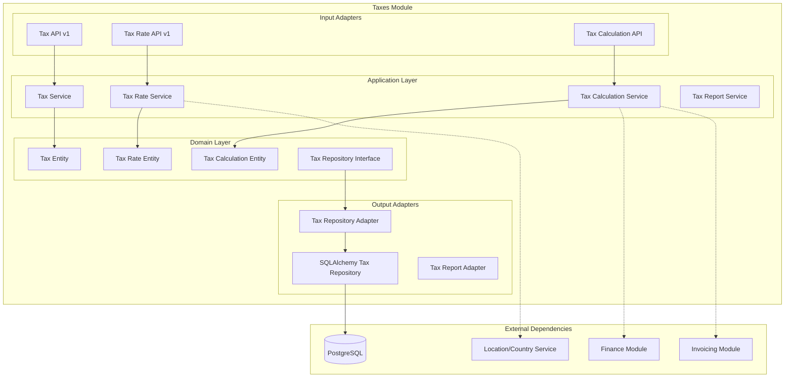

# Módulo Taxes

## Descripción

El módulo **Taxes** gestiona la configuración y cálculo de impuestos del sistema. Proporciona funcionalidades para definir diferentes tipos de impuestos, tasas aplicables y reglas de cálculo para transacciones comerciales.

## Estado del Módulo

⚠️ **En Desarrollo**: Este módulo está en fase de desarrollo inicial. La documentación refleja la arquitectura planificada basada en la configuración de permisos existente.

## Funcionalidades Planificadas

- 🧮 **Gestión de impuestos** (IVA, ISR, retenciones)
- 📊 **Configuración de tasas** por región/país
- 🔢 **Cálculo automático** de impuestos
- 📅 **Vigencia temporal** de tasas
- 🏢 **Impuestos por tipo** de empresa
- 📋 **Categorías de impuestos** (ventas, compras, nómina)
- 🌍 **Localización** por jurisdicción
- 📈 **Reportes fiscales** y declaraciones

## Arquitectura del Módulo



## Permisos del Módulo

```python
class ModuleTaxesPermission(PermissionGroup):
    group = "taxes"
    
    read = "Lee Impuestos"
    write = "Crea Impuestos"
    update = "Modifica Impuestos"
    delete = "Elimina Impuestos"
```

### Configuración del Módulo

```python
class TaxesModule(ModuleSetup):
    name = "Taxes"
    token = "taxes"
    description = "Permite operar los impuestos (taxes)."
```

## Servicios Planificados

```python
# Servicios que expondrá el módulo
@property
def service(self) -> Dict[str, object]:
    return {
        "taxes.tax_service": self._container.tax_service,
        "taxes.tax_rate_service": self._container.tax_rate_service,
        "taxes.calculation_service": self._container.calculation_service,
        "taxes.report_service": self._container.report_service,
    }
```

## API Endpoints Planificados

### Base Path: `/taxes/v1`

| Método | Endpoint | Descripción | Permisos |
|--------|----------|-------------|----------|
| GET | `/taxes` | Listar impuestos | `taxes.read` |
| POST | `/taxes` | Crear impuesto | `taxes.write` |
| GET | `/taxes/{id}` | Detalle de impuesto | `taxes.read` |
| PUT | `/taxes/{id}` | Actualizar impuesto | `taxes.update` |
| DELETE | `/taxes/{id}` | Eliminar impuesto | `taxes.delete` |
| GET | `/tax-rates` | Listar tasas de impuestos | `taxes.read` |
| POST | `/tax-rates` | Crear tasa de impuesto | `taxes.write` |
| POST | `/calculate` | Calcular impuestos | `taxes.read` |
| GET | `/reports/summary` | Resumen fiscal | `taxes.read` |

## Entidades de Dominio Planificadas

### Tax Entity (Impuesto)
```python
@dataclass
class Tax:
    id: Optional[int] = None
    name: str = ""                    # ej: "IVA General"
    code: str = ""                    # ej: "IVA_GEN"
    type: str = ""                    # ej: "sales", "purchase", "withholding"
    category: str = ""                # ej: "VAT", "income_tax", "payroll"
    description: str = ""
    active: bool = True
    country_code: str = ""            # ej: "MX", "CO", "PE"
    created_at: Optional[datetime] = None
```

### Tax Rate Entity (Tasa de Impuesto)
```python
@dataclass
class TaxRate:
    id: Optional[int] = None
    tax_id: int = 0
    rate: Decimal = Decimal('0.00')   # ej: 0.16 para 16%
    effective_from: date = None       # Fecha de vigencia
    effective_to: Optional[date] = None
    region: Optional[str] = None      # ej: "CDMX", "Bogotá"
    entity_type: Optional[str] = None # ej: "individual", "company"
    active: bool = True
```

### Tax Calculation Entity (Cálculo de Impuesto)
```python
@dataclass
class TaxCalculation:
    id: Optional[int] = None
    base_amount: Decimal = Decimal('0.00')
    tax_id: int = 0
    tax_rate: Decimal = Decimal('0.00')
    tax_amount: Decimal = Decimal('0.00')
    calculation_date: datetime = None
    reference_type: str = ""          # ej: "invoice", "purchase_order"
    reference_id: int = 0
    metadata: dict = field(default_factory=dict)
```

## Uso en Otros Módulos

### Cálculo de Impuestos en Facturación

```python
# En el módulo Invoicing
from shared.interfaces.service_locator import service_locator

async def calculate_invoice_taxes(invoice_data: dict):
    calculation_service = service_locator.get_service("taxes.calculation_service")
    
    # Calcular impuestos por ítem
    total_tax = Decimal('0.00')
    tax_details = []
    
    for item in invoice_data['items']:
        # Determinar impuestos aplicables
        applicable_taxes = await calculation_service.get_applicable_taxes(
            amount=item['amount'],
            product_category=item.get('category'),
            country=invoice_data['country'],
            transaction_type='sale'
        )
        
        # Calcular cada impuesto
        for tax in applicable_taxes:
            tax_calc = await calculation_service.calculate_tax(
                base_amount=item['amount'],
                tax_id=tax.id,
                calculation_date=invoice_data['date']
            )
            
            total_tax += tax_calc.tax_amount
            tax_details.append(tax_calc)
    
    return {
        'subtotal': sum(item['amount'] for item in invoice_data['items']),
        'total_tax': total_tax,
        'total': subtotal + total_tax,
        'tax_breakdown': tax_details
    }
```

### Validación de Tasas de Impuesto

```python
# En módulo Finance para validar transacciones
async def validate_transaction_taxes(transaction: dict):
    tax_service = service_locator.get_service("taxes.tax_service")
    
    # Obtener impuestos configurados para el país
    country_taxes = await tax_service.get_taxes_by_country(
        transaction['country_code']
    )
    
    # Validar que los impuestos aplicados son correctos
    for applied_tax in transaction.get('taxes', []):
        tax_config = next(
            (t for t in country_taxes if t.code == applied_tax['code']), 
            None
        )
        
        if not tax_config:
            raise TaxValidationError(
                f"Impuesto {applied_tax['code']} no válido para {transaction['country_code']}"
            )
        
        # Validar tasa aplicada
        current_rate = await tax_service.get_current_rate(
            tax_config.id, 
            transaction['date']
        )
        
        if abs(applied_tax['rate'] - current_rate.rate) > Decimal('0.001'):
            raise TaxRateError(
                f"Tasa incorrecta para {applied_tax['code']}. "
                f"Esperada: {current_rate.rate}, Aplicada: {applied_tax['rate']}"
            )
```

### Inyección en FastAPI

```python
from shared.interfaces.service_locator import service_locator

@router.post("/calculate-taxes")
async def calculate_taxes(
    calculation_service = Depends(service_locator.get_dependency("taxes.calculation_service")),
    request: TaxCalculationRequest,
):
    # Calcular impuestos para una transacción
    result = await calculation_service.calculate_transaction_taxes(
        base_amount=request.amount,
        country=request.country,
        transaction_type=request.type,
        date=request.date or datetime.now().date()
    )
    
    return {
        "base_amount": request.amount,
        "taxes": result.tax_breakdown,
        "total_tax": result.total_tax,
        "total_amount": result.total_amount
    }
```

## Configuración de Impuestos

### Impuestos por País

```python
# Configuración de impuestos México
MEXICO_TAXES = [
    {
        "name": "IVA General",
        "code": "IVA_GEN",
        "type": "sales",
        "category": "VAT",
        "country_code": "MX",
        "rates": [
            {"rate": 0.16, "effective_from": "2010-01-01", "region": "general"},
            {"rate": 0.08, "effective_from": "2010-01-01", "region": "frontera"}
        ]
    },
    {
        "name": "ISR Retención",
        "code": "ISR_RET",
        "type": "withholding",
        "category": "income_tax",
        "country_code": "MX",
        "rates": [
            {"rate": 0.10, "effective_from": "2021-01-01", "entity_type": "individual"}
        ]
    }
]

# Configuración de impuestos Colombia
COLOMBIA_TAXES = [
    {
        "name": "IVA General",
        "code": "IVA_COL",
        "type": "sales",
        "category": "VAT",
        "country_code": "CO",
        "rates": [
            {"rate": 0.19, "effective_from": "2017-01-01"}
        ]
    }
]
```

### Reglas de Aplicación

```python
# Reglas para determinar impuestos aplicables
TAX_RULES = {
    "sales_invoice": {
        "MX": ["IVA_GEN"],
        "CO": ["IVA_COL"],
        "PE": ["IGV_PER"]
    },
    "purchase_invoice": {
        "MX": ["IVA_GEN", "ISR_RET"],
        "CO": ["IVA_COL", "RETEICA"],
        "PE": ["IGV_PER", "IR_RET"]
    },
    "payroll": {
        "MX": ["ISR_NOM", "IMSS"],
        "CO": ["RENTA_NOM", "SALUD"],
        "PE": ["IR_QUINTA", "ESSALUD"]
    }
}

async def get_applicable_taxes(
    transaction_type: str, 
    country: str, 
    amount: Decimal,
    **kwargs
) -> List[Tax]:
    tax_service = service_locator.get_service("taxes.tax_service")
    
    # Obtener códigos de impuestos aplicables
    tax_codes = TAX_RULES.get(transaction_type, {}).get(country, [])
    
    # Obtener configuración de impuestos
    taxes = []
    for code in tax_codes:
        tax = await tax_service.get_by_code(code)
        if tax and tax.active:
            # Aplicar reglas adicionales si es necesario
            if await should_apply_tax(tax, amount, **kwargs):
                taxes.append(tax)
    
    return taxes
```

## Cálculos de Impuestos

### Motor de Cálculo

```python
class TaxCalculationEngine:
    def __init__(self, tax_service, tax_rate_service):
        self.tax_service = tax_service
        self.tax_rate_service = tax_rate_service
    
    async def calculate_tax(
        self, 
        base_amount: Decimal, 
        tax_id: int, 
        calculation_date: date
    ) -> TaxCalculation:
        # Obtener configuración del impuesto
        tax = await self.tax_service.get_by_id(tax_id)
        
        # Obtener tasa vigente
        tax_rate = await self.tax_rate_service.get_rate_for_date(
            tax_id, 
            calculation_date
        )
        
        # Calcular monto del impuesto
        tax_amount = base_amount * tax_rate.rate
        
        return TaxCalculation(
            base_amount=base_amount,
            tax_id=tax_id,
            tax_rate=tax_rate.rate,
            tax_amount=tax_amount,
            calculation_date=datetime.now()
        )
    
    async def calculate_compound_taxes(
        self, 
        base_amount: Decimal, 
        tax_ids: List[int], 
        calculation_date: date
    ) -> List[TaxCalculation]:
        """Calcular impuestos compuestos (impuesto sobre impuesto)"""
        calculations = []
        current_base = base_amount
        
        for tax_id in tax_ids:
            calc = await self.calculate_tax(current_base, tax_id, calculation_date)
            calculations.append(calc)
            
            # Para impuestos compuestos, el siguiente se calcula sobre base + impuesto anterior
            tax = await self.tax_service.get_by_id(tax_id)
            if tax.is_compound:
                current_base += calc.tax_amount
        
        return calculations
```

### Redondeo y Precisión

```python
from decimal import Decimal, ROUND_HALF_UP

class TaxRoundingService:
    @staticmethod
    def round_tax_amount(amount: Decimal, country: str = "MX") -> Decimal:
        """Redondear según reglas fiscales del país"""
        
        # Reglas de redondeo por país
        rounding_rules = {
            "MX": 2,  # 2 decimales
            "CO": 0,  # Sin decimales (pesos)
            "PE": 2,  # 2 decimales
        }
        
        decimals = rounding_rules.get(country, 2)
        
        if decimals == 0:
            return amount.quantize(Decimal('1'), rounding=ROUND_HALF_UP)
        else:
            return amount.quantize(
                Decimal('0.' + '0' * decimals), 
                rounding=ROUND_HALF_UP
            )
```

## Reportes Fiscales

### Generador de Reportes

```python
async def generate_tax_summary_report(
    start_date: date, 
    end_date: date, 
    country: str
):
    report_service = service_locator.get_service("taxes.report_service")
    
    # Obtener todas las transacciones del período
    transactions = await report_service.get_transactions_by_period(
        start_date, end_date, country
    )
    
    # Agrupar por tipo de impuesto
    tax_summary = {}
    
    for transaction in transactions:
        for tax_calc in transaction.tax_calculations:
            tax_code = tax_calc.tax.code
            
            if tax_code not in tax_summary:
                tax_summary[tax_code] = {
                    "tax_name": tax_calc.tax.name,
                    "total_base": Decimal('0.00'),
                    "total_tax": Decimal('0.00'),
                    "transaction_count": 0
                }
            
            tax_summary[tax_code]["total_base"] += tax_calc.base_amount
            tax_summary[tax_code]["total_tax"] += tax_calc.tax_amount
            tax_summary[tax_code]["transaction_count"] += 1
    
    return {
        "period": {"start": start_date, "end": end_date},
        "country": country,
        "summary": tax_summary,
        "total_tax_collected": sum(s["total_tax"] for s in tax_summary.values())
    }
```

## Extensiones Futuras

### Funcionalidades Avanzadas

- **Impuestos especiales**: Licores, tabaco, combustibles
- **Exenciones fiscales**: Productos exentos por categoría
- **Impuestos municipales**: Tasas locales variables
- **Retenciones automáticas**: Cálculo de retenciones en origen
- **Declaraciones automáticas**: Generación de formularios fiscales
- **Integración contable**: Asientos automáticos de impuestos

### Integraciones Planificadas

- **Servicios fiscales**: APIs de hacienda/DIAN/SUNAT
- **Contabilidad**: Módulo de contabilidad para asientos
- **Nómina**: Cálculo de impuestos sobre salarios
- **Inventario**: Impuestos específicos por producto
- **Reportes**: Dashboard fiscal y analytics

## Notas de Desarrollo

⚠️ **Estado Actual**: El módulo está en desarrollo inicial. Existe la configuración básica de permisos pero falta:

1. Implementación de entidades de dominio
2. Servicios de aplicación
3. Adaptadores de persistencia
4. APIs REST
5. Motor de cálculo de impuestos
6. Tests unitarios

La documentación actual sirve como guía arquitectural para el desarrollo del módulo de impuestos.