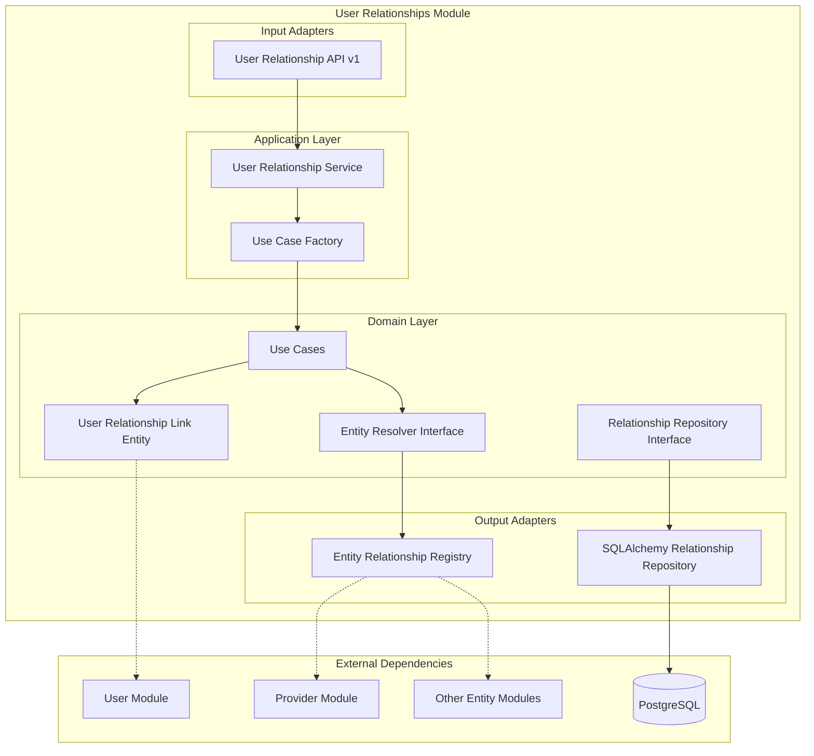

# Módulo User Relationships

## Descripción

El módulo **User Relationships** gestiona las relaciones dinámicas entre usuarios y diferentes entidades del sistema. Proporciona un mecanismo flexible para asociar usuarios con cualquier tipo de entidad (proveedores, proyectos, departamentos, etc.) sin acoplar el código.

## Funcionalidades

- ✅ **Asociaciones dinámicas** usuario-entidad
- ✅ **Registro de entidades** flexible
- ✅ **Resolución de tipos** de entidad
- ✅ **CRUD de relaciones** (crear, consultar, eliminar)
- ✅ **Consulta de entidades** por usuario
- ✅ **Consulta de usuarios** por entidad
- ✅ **Validación de existencia** de entidades

## Arquitectura del Módulo



## Servicios Expuestos

```python
@property
def service(self) -> Dict[str, object]:
    return {"user_relationship_service": self._container.service}
```

### user_relationship_service
- **Propósito**: Gestión completa de relaciones usuario-entidad
- **Funciones**: Asociar, desasociar, consultar relaciones
- **Dependencias**: Entity Resolver Registry

## API Endpoints

### Base Path: `/user_relationships/v1/user_relationships`

| Método | Endpoint | Descripción | Headers Requeridos |
|--------|----------|-------------|-------------------|
| GET | `/entity` | Obtener instancia de entidad | - |
| GET | `/{user_uuid}` | Obtener entidades de usuario | `entity_key` |
| POST | `/{user_uuid}/link` | Asociar usuario con entidad | `entity_key`, `entity_id` |
| DELETE | `/{user_uuid}/link` | Eliminar asociación | `entity_key`, `entity_id` |

### Parámetros

- **user_uuid**: UUID del usuario
- **entity_key**: Tipo de entidad (ej: "provider", "project")
- **entity_id**: ID de la entidad específica

## Container de Dependencias

```python
class UserRelationshipContainer(DeclarativeContainer):
    wiring_config = WiringConfiguration(packages=["."], auto_wire=True)
    
    # Registry de entidades como Singleton
    resolver = Singleton(EntityRelationshipRegistry)
    
    # Repositorio SQLAlchemy
    user_relationship_repository = Factory(UserRelationshipSQLAlchemyRepository)
    
    # Servicio principal
    service = Factory(
        UserRelationshipService,
        resolver=resolver,
        user_relationship_repository=user_relationship_repository,
    )
```

### Características del Container

- **Registry singleton**: Una instancia compartida del registro de entidades
- **Repositorio factory**: Nueva instancia por inyección
- **Resolver pattern**: Para resolución dinámica de tipos

## Dependencias Externas

### Módulos Relacionados
- **User Module**: Para validación de usuarios
- **Cualquier módulo**: Que registre entidades en el sistema

### Infraestructura
- **PostgreSQL**: Persistencia de relaciones

## Modelo de Datos

### UserRelationshipLink Entity
```python
class UserRelationshipLink(SQLModel, table=True):
    fk_user: uuid.UUID = Field(foreign_key="user.id", primary_key=True)
    fk_entity: int = Field(primary_key=True)
    entity_name: str = Field(primary_key=True)
```

### Características del Modelo

- **Clave compuesta**: usuario + entidad + tipo de entidad
- **Referencia flexible**: No FK rígidas a entidades específicas
- **Tipo dinámico**: entity_name permite diferentes tipos

## Registry de Entidades

### EntityRelationshipRegistry

```python
class EntityRelationshipRegistry(EntityResolver):
    _registry: dict[str, Type[SQLModel]] = {}
    
    def resolve(self, tipo: str) -> type:
        try:
            return self._registry[tipo]
        except KeyError:
            raise EntityRelationShipNotFoundException
    
    @classmethod
    def register(cls, tipo: str, model: type):
        cls._registry[tipo] = model
```

### Registro de Entidades

```python
# En el módulo Provider
from modules.user_relationships.adapter.output.registry import EntityRelationshipRegistry
from modules.provider.domain.entity.provider import Provider

# Registrar la entidad Provider
EntityRelationshipRegistry.register("provider", Provider)
```

## Uso en Otros Módulos

### Asociar Usuario con Proveedor

```python
from shared.interfaces.service_locator import service_locator
import uuid

# Obtener servicio de relaciones
relationship_service = service_locator.get_service("user_relationship_service")

# Asociar usuario con proveedor
user_id = uuid.UUID("123e4567-e89b-12d3-a456-426614174000")
provider_id = 456

await relationship_service.associate_user_with_entity(
    user_uuid=user_id,
    id_entity=provider_id,
    entity_type="provider"
)
```

### Obtener Proveedores de un Usuario

```python
# Obtener todos los proveedores asociados a un usuario
user_providers = await relationship_service.get_entities(
    user_uuid=user_id,
    entity_type="provider"
)

print(f"Usuario tiene {len(user_providers)} proveedores asociados")
for provider in user_providers:
    print(f"- {provider.name}")
```

### Inyección en FastAPI

```python
from shared.interfaces.service_locator import service_locator

@router.get("/my-providers")
async def get_my_providers(
    relationship_service = Depends(service_locator.get_dependency("user_relationship_service")),
    current_user = Depends(get_current_user),
):
    # Obtener proveedores del usuario actual
    providers = await relationship_service.get_entities(
        user_uuid=current_user.id,
        entity_type="provider"
    )
    
    return {"providers": providers, "count": len(providers)}
```

## Casos de Uso Implementados

### Asociar Usuario con Entidad

```python
# Use case: Associate User with Entity
async def associate_user_with_entity(
    user_uuid: UUID, 
    entity_id: int, 
    entity_type: str
):
    # Validar que la entidad existe
    entity = await self.resolver.resolve(entity_type)
    entity_instance = await self.get_entity_by_id(entity_id, entity)
    
    if not entity_instance:
        raise EntityNotFoundException(f"Entity {entity_type}:{entity_id} not found")
    
    # Crear relación
    relationship = UserRelationshipLink(
        fk_user=user_uuid,
        fk_entity=entity_id,
        entity_name=entity_type
    )
    
    await self.repository.save(relationship)
```

### Obtener Entidades de Usuario

```python
# Use case: Get User Entities
async def get_user_entities(user_uuid: UUID, entity_type: str):
    # Obtener relaciones del usuario
    relationships = await self.repository.get_by_user_and_type(
        user_uuid, 
        entity_type
    )
    
    # Resolver tipo de entidad
    entity_class = self.resolver.resolve(entity_type)
    
    # Obtener instancias de las entidades
    entities = []
    for rel in relationships:
        entity = await self.get_entity_by_id(rel.fk_entity, entity_class)
        if entity:
            entities.append(entity)
    
    return entities
```

## Ejemplos de Uso Avanzado

### Registro Automático de Entidades

```python
# En el startup de cada módulo
async def register_module_entities():
    from modules.user_relationships.adapter.output.registry import EntityRelationshipRegistry
    
    # Registrar entidades del módulo Provider
    EntityRelationshipRegistry.register("provider", Provider)
    EntityRelationshipRegistry.register("provider_contact", ProviderContact)
    
    # Registrar entidades del módulo Project (si existe)
    EntityRelationshipRegistry.register("project", Project)
    EntityRelationshipRegistry.register("task", Task)
    
    print("Entidades registradas en User Relationships")
```

### Middleware de Autorización

```python
# Middleware para verificar acceso a entidades
async def check_entity_access(
    user_id: UUID, 
    entity_type: str, 
    entity_id: int
):
    relationship_service = service_locator.get_service("user_relationship_service")
    
    # Obtener entidades del usuario
    user_entities = await relationship_service.get_entities(
        user_uuid=user_id,
        entity_type=entity_type
    )
    
    # Verificar si tiene acceso a la entidad específica
    has_access = any(entity.id == entity_id for entity in user_entities)
    
    if not has_access:
        raise HTTPException(403, f"Sin acceso a {entity_type}:{entity_id}")
    
    return True
```

### Búsqueda Multi-Entidad

```python
# Buscar en múltiples tipos de entidad
async def search_user_entities(user_id: UUID, search_term: str):
    relationship_service = service_locator.get_service("user_relationship_service")
    
    # Tipos de entidad a buscar
    entity_types = ["provider", "project", "department"]
    
    results = {}
    for entity_type in entity_types:
        try:
            entities = await relationship_service.get_entities(
                user_uuid=user_id,
                entity_type=entity_type
            )
            
            # Filtrar por término de búsqueda
            filtered = [
                e for e in entities 
                if search_term.lower() in e.name.lower()
            ]
            
            if filtered:
                results[entity_type] = filtered
                
        except EntityRelationShipNotFoundException:
            continue  # Tipo de entidad no registrado
    
    return results
```

## Integración con Otros Módulos

### Módulo Provider

```python
# En el Provider module
class ProviderService:
    async def get_user_providers(self, user_id: UUID):
        relationship_service = service_locator.get_service("user_relationship_service")
        
        # Obtener proveedores del usuario
        providers = await relationship_service.get_entities(
            user_uuid=user_id,
            entity_type="provider"
        )
        
        return providers
    
    async def assign_provider_to_user(self, provider_id: int, user_id: UUID):
        relationship_service = service_locator.get_service("user_relationship_service")
        
        # Crear asociación
        await relationship_service.associate_user_with_entity(
            user_uuid=user_id,
            id_entity=provider_id,
            entity_type="provider"
        )
```

### Módulo RBAC

```python
# Integración con permisos
async def check_entity_permission(
    user_id: UUID, 
    entity_type: str, 
    entity_id: int, 
    permission: str
):
    # Verificar acceso a la entidad
    await check_entity_access(user_id, entity_type, entity_id)
    
    # Verificar permiso específico
    role_service = service_locator.get_service("rbac.role_service")
    has_permission = await role_service.user_has_permission(
        user_id, 
        f"{entity_type}.{permission}"
    )
    
    return has_permission
```

## Patrones de Uso

### Patrón Repository Dinámico

```python
# Repositorio que se adapta al tipo de entidad
class DynamicEntityRepository:
    def __init__(self, relationship_service):
        self.relationship_service = relationship_service
    
    async def get_user_entities(self, user_id: UUID, entity_type: str):
        return await self.relationship_service.get_entities(
            user_uuid=user_id,
            entity_type=entity_type
        )
    
    async def filter_by_user_access(self, user_id: UUID, entities: List, entity_type: str):
        user_entities = await self.get_user_entities(user_id, entity_type)
        user_entity_ids = {e.id for e in user_entities}
        
        return [e for e in entities if e.id in user_entity_ids]
```

### Patrón Decorator para Autorización

```python
from modules.user_relationships.shared.decorators import require_entity_access

@require_entity_access("provider")
async def update_provider(provider_id: int, data: dict, current_user: User):
    # Solo se ejecuta si el usuario tiene acceso al proveedor
    provider_service = service_locator.get_service("provider_service")
    return await provider_service.update(provider_id, data)
```

## Extensiones Futuras

### Funcionalidades Planificadas

- **Roles en relaciones**: Diferentes tipos de relación (owner, viewer, editor)
- **Herencia de relaciones**: Relaciones transitivas
- **Expiración de relaciones**: Relaciones temporales
- **Auditoría de cambios**: Historial de asociaciones
- **Notificaciones**: Alertas de cambios en entidades relacionadas

### Integraciones Sugeridas

- **Workflow**: Aprobaciones basadas en relaciones
- **Reporting**: Reportes filtrados por relaciones de usuario
- **Cache**: Cache de relaciones frecuentes
- **Search**: Búsqueda contextual basada en relaciones