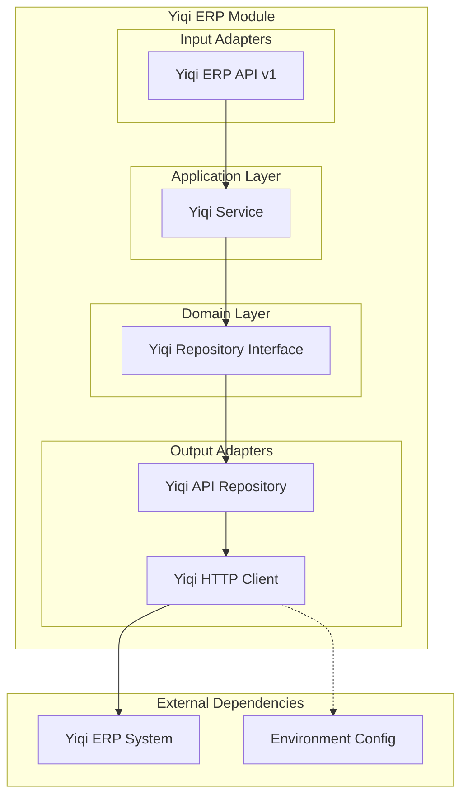

# Módulo Yiqi ERP

## Descripción

El módulo **Yiqi ERP** proporciona integración con el sistema ERP externo Yiqi, permitiendo sincronización de datos maestros, consulta de información y carga de archivos. Actúa como un adaptador entre el sistema interno y la API externa del ERP.

## Funcionalidades

- ✅ **Consulta de monedas** desde Yiqi ERP
- ✅ **Lista de servicios** disponibles
- ✅ **Información de proveedores** por ID
- ✅ **Carga de archivos** al ERP
- ✅ **Cliente HTTP** configurado con autenticación
- ✅ **Manejo de timeouts** y configuración flexible
- ✅ **Integración asíncrona** con httpx

## Arquitectura del Módulo



## Servicios Expuestos

```python
@property
def service(self) -> Dict[str, object]:
    return {"yiqi_erp_service": self._container.service}
```

### yiqi_erp_service
- **Propósito**: Integración completa con Yiqi ERP
- **Funciones**: Consultas de datos maestros, carga de archivos
- **Dependencias**: Configuración de API externa

## API Endpoints

### Base Path: `/yiqi_erp/v1/yiqi_erp`

| Método | Endpoint | Descripción | Autenticación |
|--------|----------|-------------|---------------|
| GET | `/currency_list` | Listar monedas del ERP | Sí |
| GET | `/currency_list/{currency_code}` | Moneda por código | Sí |
| GET | `/services_list` | Listar servicios disponibles | Sí |
| GET | `/provider/{id_provider}` | Proveedor por ID | Sí |
| POST | `/upload_file` | Cargar archivo al ERP | Sí |

### Parámetros Automáticos

- **id_schema**: ID del esquema Yiqi (desde configuración)

## Container de Dependencias

```python
class YiqiContainer(DeclarativeContainer):
    wiring_config = WiringConfiguration(packages=["."], auto_wire=True)
    
    # Configuración desde environment
    config = Configuration(pydantic_settings=[env])
    
    # Cliente HTTP como Singleton
    client = Singleton(
        YiqiHttpClient,
        base_url=config.YIQI_BASE_URL,
        api_key=config.YIQI_API_TOKEN,
        api_timeout=200.0,
    )
    
    # Repositorio API
    repository = Factory(
        YiqiApiRepository,
        client=client,
    )
    
    # Servicio principal
    service = Factory(YiqiService, yiqi_repository=repository)
    
    async def shutdown(self):
        await self.client().close()
```

### Características del Container

- **Cliente singleton**: Una conexión HTTP reutilizable
- **Configuración externa**: Variables de entorno
- **Shutdown graceful**: Cierre limpio de conexiones

## Configuración Requerida

### Variables de Entorno

```bash
# Configuración Yiqi ERP
YIQI_BASE_URL=https://api.yiqi-erp.com
YIQI_API_TOKEN=your_api_token_here
YIQI_SCHEMA=123  # ID del esquema/empresa
```

## Cliente HTTP

### YiqiHttpClient

```python
@dataclass
class YiqiHttpClient:
    base_url: str
    api_key: str
    api_timeout: float = 30.0
    
    def __post_init__(self):
        self._client = httpx.AsyncClient(
            base_url=self.base_url,
            headers={"Authorization": f"Bearer {self.api_key}"},
            timeout=self.api_timeout
        )
```

### Características del Cliente

- **Autenticación automática**: Bearer token en headers
- **Timeout configurable**: Control de tiempo de espera
- **Async/await**: Operaciones no bloqueantes
- **Content-Type detection**: Manejo automático de tipos de contenido

## Uso en Otros Módulos

### Sincronizar Monedas

```python
from shared.interfaces.service_locator import service_locator

# Obtener servicio Yiqi ERP
yiqi_service = service_locator.get_service("yiqi_erp_service")

# Obtener monedas del ERP
erp_currencies = await yiqi_service.get_currency_list(schema_id=123)

# Sincronizar con módulo Finance local
finance_service = service_locator.get_service("currency_service")

for erp_currency in erp_currencies:
    # Verificar si existe localmente
    local_currency = await finance_service.get_by_code(erp_currency.code)
    
    if not local_currency:
        # Crear moneda local desde ERP
        await finance_service.create_currency_and_save({
            "name": erp_currency.name,
            "code": erp_currency.code,
            "symbol": erp_currency.symbol
        })
```

### Validar Proveedor en ERP

```python
# En módulo Provider
async def validate_provider_in_erp(self, provider_id: int):
    yiqi_service = service_locator.get_service("yiqi_erp_service")
    
    try:
        # Consultar proveedor en ERP
        erp_provider = await yiqi_service.get_provider_by_id(
            provider_id, 
            schema_id=123
        )
        
        if erp_provider:
            return {
                "valid": True,
                "erp_data": erp_provider,
                "status": "active" if erp_provider.active else "inactive"
            }
    
    except Exception as e:
        return {
            "valid": False,
            "error": str(e),
            "status": "not_found"
        }
```

### Inyección en FastAPI

```python
from shared.interfaces.service_locator import service_locator

@router.post("/sync-erp-data")
async def sync_erp_data(
    yiqi_service = Depends(service_locator.get_dependency("yiqi_erp_service")),
    data_type: str = Query(..., description="currency|services|providers"),
):
    if data_type == "currency":
        # Sincronizar monedas
        currencies = await yiqi_service.get_currency_list(schema_id=123)
        return {"synced": len(currencies), "data": currencies}
    
    elif data_type == "services":
        # Sincronizar servicios
        services = await yiqi_service.get_services_list(schema_id=123)
        return {"synced": len(services), "data": services}
    
    else:
        raise HTTPException(400, "Tipo de datos no soportado")
```

## Casos de Uso Comunes

### Sincronización Programada

```python
# Job programado para sincronización
import asyncio
from datetime import datetime

async def scheduled_erp_sync():
    """Sincronización programada con Yiqi ERP"""
    yiqi_service = service_locator.get_service("yiqi_erp_service")
    
    try:
        print(f"[{datetime.now()}] Iniciando sincronización ERP...")
        
        # Sincronizar monedas
        currencies = await yiqi_service.get_currency_list(schema_id=123)
        await sync_currencies_to_local(currencies)
        
        # Sincronizar servicios
        services = await yiqi_service.get_services_list(schema_id=123)
        await sync_services_to_local(services)
        
        print(f"[{datetime.now()}] Sincronización completada")
        
    except Exception as e:
        print(f"[{datetime.now()}] Error en sincronización: {e}")

# Ejecutar cada 6 horas
async def start_sync_scheduler():
    while True:
        await scheduled_erp_sync()
        await asyncio.sleep(6 * 3600)  # 6 horas
```

### Carga de Documentos

```python
# Cargar factura al ERP
async def upload_invoice_to_erp(invoice_file: bytes, invoice_data: dict):
    yiqi_service = service_locator.get_service("yiqi_erp_service")
    
    # Preparar request de carga
    upload_request = YiqiUploadFileRequest(
        file_content=invoice_file,
        file_name=f"invoice_{invoice_data['number']}.pdf",
        document_type="invoice",
        metadata=invoice_data
    )
    
    # Cargar al ERP
    result = await yiqi_service.upload_file(upload_request, schema_id=123)
    
    return {
        "uploaded": True,
        "erp_file_id": result.file_id,
        "erp_url": result.file_url
    }
```

### Health Check ERP

```python
@router.get("/health/erp")
async def check_erp_health():
    yiqi_service = service_locator.get_service("yiqi_erp_service")
    
    try:
        # Test simple: obtener lista de monedas
        currencies = await yiqi_service.get_currency_list(schema_id=123)
        
        return {
            "status": "healthy",
            "erp_available": True,
            "response_time": "< 2s",
            "last_sync": datetime.now().isoformat(),
            "currencies_count": len(currencies)
        }
    
    except Exception as e:
        return {
            "status": "unhealthy",
            "erp_available": False,
            "error": str(e),
            "last_sync": None
        }
```

## Manejo de Errores

### Retry Logic

```python
import asyncio
from typing import Any

async def erp_request_with_retry(
    operation: callable, 
    max_retries: int = 3,
    delay: float = 1.0
) -> Any:
    """Ejecutar operación ERP con reintentos"""
    
    for attempt in range(max_retries):
        try:
            return await operation()
        
        except httpx.TimeoutException:
            if attempt == max_retries - 1:
                raise ERPTimeoutException("ERP no responde después de varios intentos")
            
            await asyncio.sleep(delay * (2 ** attempt))  # Backoff exponencial
        
        except httpx.HTTPStatusError as e:
            if e.response.status_code >= 500:
                # Error del servidor, reintentar
                if attempt == max_retries - 1:
                    raise ERPServerException(f"Error del servidor ERP: {e}")
                await asyncio.sleep(delay)
            else:
                # Error del cliente, no reintentar
                raise ERPClientException(f"Error en request: {e}")
    
    raise ERPException("Máximo número de reintentos alcanzado")
```

### Circuit Breaker

```python
from datetime import datetime, timedelta

class ERPCircuitBreaker:
    def __init__(self, failure_threshold: int = 5, timeout: int = 60):
        self.failure_threshold = failure_threshold
        self.timeout = timeout
        self.failure_count = 0
        self.last_failure_time = None
        self.state = "CLOSED"  # CLOSED, OPEN, HALF_OPEN
    
    async def call(self, operation: callable):
        if self.state == "OPEN":
            if self._should_attempt_reset():
                self.state = "HALF_OPEN"
            else:
                raise ERPCircuitOpenException("Circuit breaker is OPEN")
        
        try:
            result = await operation()
            self._on_success()
            return result
        
        except Exception as e:
            self._on_failure()
            raise e
    
    def _should_attempt_reset(self) -> bool:
        return (
            self.last_failure_time and 
            datetime.now() - self.last_failure_time > timedelta(seconds=self.timeout)
        )
    
    def _on_success(self):
        self.failure_count = 0
        self.state = "CLOSED"
    
    def _on_failure(self):
        self.failure_count += 1
        self.last_failure_time = datetime.now()
        
        if self.failure_count >= self.failure_threshold:
            self.state = "OPEN"
```

## Monitoreo y Logging

### Métricas de Integración

```python
# Métricas de performance ERP
async def get_erp_metrics():
    return {
        "total_requests": await get_total_erp_requests(),
        "success_rate": await get_erp_success_rate(),
        "avg_response_time": await get_avg_response_time(),
        "last_sync_time": await get_last_sync_time(),
        "failed_requests_24h": await get_failed_requests_count(24),
        "circuit_breaker_state": circuit_breaker.state
    }
```

### Logging Estructurado

```python
import logging
import json

logger = logging.getLogger("yiqi_erp")

async def log_erp_operation(operation: str, data: dict, result: dict):
    log_entry = {
        "timestamp": datetime.now().isoformat(),
        "module": "yiqi_erp",
        "operation": operation,
        "input_data": data,
        "result": result,
        "success": result.get("success", False)
    }
    
    if result.get("success"):
        logger.info(json.dumps(log_entry))
    else:
        logger.error(json.dumps(log_entry))
```

## Extensiones Futuras

### Funcionalidades Planificadas

- **Cache de respuestas**: Redis para datos frecuentes
- **Webhook support**: Notificaciones desde ERP
- **Batch operations**: Operaciones en lote
- **Data transformation**: Mapeo de campos automático
- **Audit trail**: Registro de todas las operaciones
- **Multi-tenant**: Soporte para múltiples esquemas

### Integraciones Sugeridas

- **Queue system**: Para operaciones asíncronas
- **Monitoring**: Prometheus/Grafana para métricas
- **Alerting**: Notificaciones de fallos
- **Data warehouse**: ETL para analytics
- **API Gateway**: Rate limiting y caching